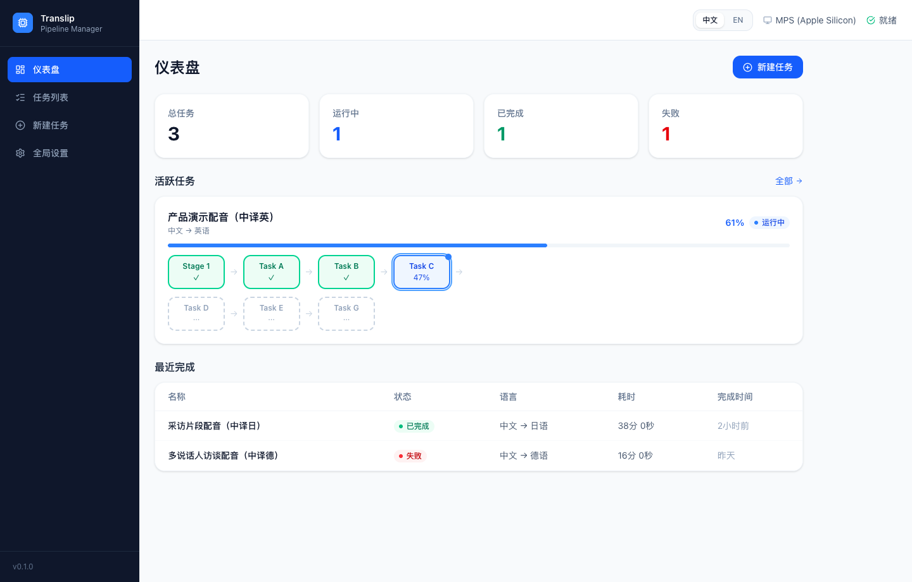
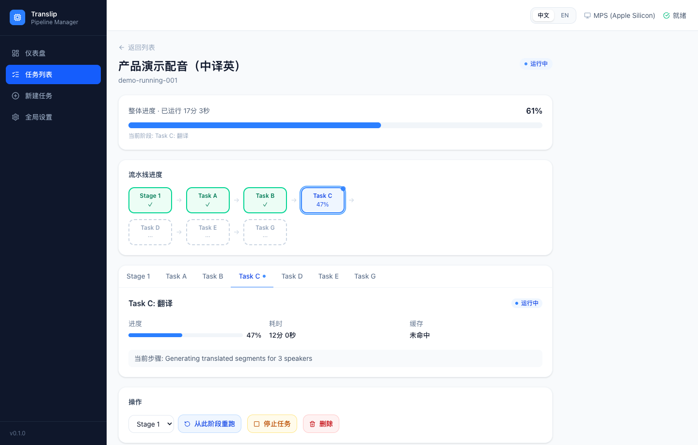
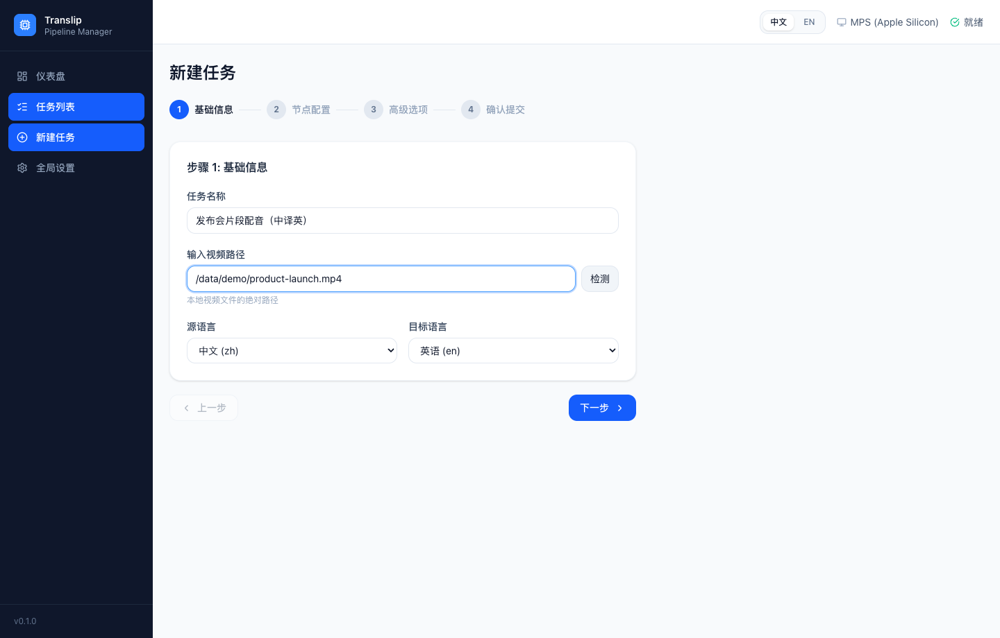
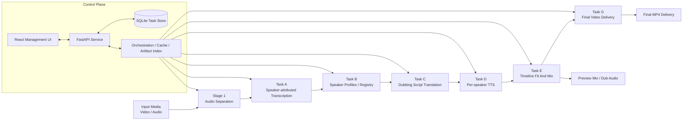

<div align="center">
  
  <h1>translip</h1>
  <p><strong>Local, speaker-aware dubbing pipeline for video workflows</strong></p>
  <p>`translip` connects source separation, speaker-attributed transcription, translation, per-speaker TTS, timeline fitting, and final video delivery into a reusable end-to-end pipeline, with a FastAPI + React management UI included.</p>
  <p>
    
    
    
    
    
  </p>
  <p>
    <a href="#quick-start"><strong>Quick Start</strong></a> ·
    <a href="#system-architecture"><strong>Architecture</strong></a> ·
    <a href="docs/README.md"><strong>Docs Index</strong></a> ·
    <a href="frontend/README.md"><strong>Frontend README</strong></a> ·
    <a href="README.md"><strong>中文 README</strong></a>
  </p>
</div>

> **Status: Beta / Early Access**
>
> `translip` is currently best suited for research workflows, internal demos, self-hosted iteration, and pipeline exploration. It already provides an end-to-end path and a management UI, but it is intentionally positioned as fast-moving beta software rather than a production-ready product claim.

## Why `translip`

- **Research-driven pipeline design**: the workflow is organized as modular stages and tasks rather than one opaque monolith.
- **Speaker-aware by default**: outputs are built around speaker profiles and registry reuse, not just plain transcription.
- **End-to-end flow**: the project covers the path from input media to final `mp4` delivery.
- **Operational UI included**: task management, progress tracking, reruns, presets, and artifact download are available through the web interface.
- **Local-first execution**: useful for model debugging, cache control, artifact inspection, and self-hosted experimentation.

## UI Preview

| Dashboard | Task Detail |
| --- | --- |
|  |  |

| New Task |
| --- |
|  |

## System Architecture



## Core Capabilities

- Separate dialogue and background audio from video or audio inputs.
- Generate speaker-attributed transcripts with `faster-whisper` + `SpeechBrain`.
- Build reusable speaker profiles and registries for later tasks.
- Produce dubbing scripts with local `M2M100` or the `SiliconFlow API`.
- Synthesize target-language speech for each speaker with `Qwen3-TTS`.
- Fit generated speech back to the original timeline and export preview/final outputs.
- Manage tasks, progress, presets, and artifacts through the web UI.

## Pipeline Stages

| Stage | Command | Purpose | Main Outputs |
| --- | --- | --- | --- |
| Stage 1 | `translip run` | Audio separation | `voice.*`, `background.*` |
| Task A | `translip transcribe` | Speaker-attributed transcription | `segments.zh.json`, `segments.zh.srt` |
| Task B | `translip build-speaker-registry` | Speaker profile / registry | `speaker_profiles.json`, `speaker_registry.json` |
| Task C | `translip translate-script` | Script translation | `translation.<lang>.json`, `translation.<lang>.srt` |
| Task D | `translip synthesize-speaker` | Single-speaker dubbing synthesis | `speaker_segments.<lang>.json`, `speaker_demo.<lang>.wav` |
| Task E | `translip render-dub` | Timeline fitting and mixdown | `dub_voice.<lang>.wav`, `preview_mix.<lang>.wav` |
| Task F | `translip run-pipeline` | Orchestrate Stage 1 to Task E | `pipeline-manifest.json`, `pipeline-status.json` |
| Task G | `translip export-video` | Final video export | `final_preview.<lang>.mp4`, `final_dub.<lang>.mp4` |

## Requirements

- Python `3.11` to `3.12`
- [uv](https://docs.astral.sh/uv/)
- FFmpeg available on `PATH`
- Node.js + npm
  Required only for frontend development or building the management UI
- macOS or Linux
  CPU is supported, while Task D is more practical with `CUDA` or `MPS`

## Installation

Base install:

```bash
git clone https://github.com/MasamiYui/translip.git
cd translip
uv sync
```

For development and tests, install the dev extras:

```bash
uv sync --extra dev
```

Recommended: preload the CDX23 model set:

```bash
uv run translip download-models --backend cdx23 --quality balanced
```

If you want to use the SiliconFlow translation backend, also set an API key:

```bash
export SILICONFLOW_API_KEY=<your-key>
```

## Quick Start

`run-pipeline` stops at `task-e` by default, which means it produces dub audio and preview mix outputs. Final video delivery is done as a separate `export-video` step.

```bash
uv run translip run-pipeline \
  --input ./test_video/example.mp4 \
  --output-root ./output-pipeline \
  --target-lang en \
  --write-status
```

Export the final video:

```bash
uv run translip export-video \
  --pipeline-root ./output-pipeline
```

Typical output layout:

```text
output-pipeline/
├── pipeline-manifest.json
├── pipeline-report.json
├── pipeline-status.json
├── logs/
├── stage1/example/
├── task-a/voice/
├── task-b/voice/
├── task-c/voice/
├── task-d/voice/<speaker-id>/
├── task-e/voice/
└── task-g/delivery/
```

Final videos are typically written to:

- `output-pipeline/task-g/delivery/final-preview/final_preview.en.mp4`
- `output-pipeline/task-g/delivery/final-dub/final_dub.en.mp4`

## Web Management UI

### Development Mode

Start the backend API first:

```bash
uv run uvicorn translip.server.app:app --host 127.0.0.1 --port 8765
```

Then start the frontend:

```bash
cd frontend
npm install
npm run dev
```

Development URLs:

- Frontend: `http://127.0.0.1:5173`
- Backend API: `http://127.0.0.1:8765`

Notes:

- `frontend/vite.config.ts` already proxies `/api` to `127.0.0.1:8765`
- the frontend uses relative API paths and does not require extra env vars in dev mode

### Serve The Built Frontend Through The Backend

Build the frontend first:

```bash
cd frontend
npm install
npm run build
cd ..
```

Then start the backend:

```bash
uv run translip-server
```

If `frontend/dist` exists, the backend automatically mounts and serves the static frontend from `http://127.0.0.1:8765`.

Notes:

- `translip-server` listens on `127.0.0.1:8765` by default
- if you need a custom host or port, use `uvicorn translip.server.app:app ...` directly

## Common CLI Commands

### Stage 1: Audio Separation

```bash
uv run translip run \
  --input ./test_video/example.mp4 \
  --mode auto \
  --quality balanced \
  --output-dir ./output-stage1
```

Generated examples:

- `./output-stage1/example/voice.wav`
- `./output-stage1/example/background.wav`

### Task A: Transcription

```bash
uv run translip transcribe \
  --input ./output-stage1/example/voice.wav \
  --output-dir ./output-task-a
```

Outputs:

- `./output-task-a/voice/segments.zh.json`
- `./output-task-a/voice/segments.zh.srt`
- `./output-task-a/voice/task-a-manifest.json`

### Task B: Speaker Registry

```bash
uv run translip build-speaker-registry \
  --segments ./output-task-a/voice/segments.zh.json \
  --audio ./output-stage1/example/voice.wav \
  --output-dir ./output-task-b \
  --registry ./output-task-b/registry/speaker_registry.json \
  --update-registry
```

### Task C: Translation

Local `M2M100`:

```bash
uv run translip translate-script \
  --segments ./output-task-a/voice/segments.zh.json \
  --profiles ./output-task-b/voice/speaker_profiles.json \
  --target-lang en \
  --backend local-m2m100 \
  --output-dir ./output-task-c
```

SiliconFlow API:

```bash
export SILICONFLOW_API_KEY=<your-key>

uv run translip translate-script \
  --segments ./output-task-a/voice/segments.zh.json \
  --profiles ./output-task-b/voice/speaker_profiles.json \
  --target-lang en \
  --backend siliconflow \
  --api-model deepseek-ai/DeepSeek-V3 \
  --output-dir ./output-task-c
```

### Task D: Single-speaker Synthesis

```bash
uv run translip synthesize-speaker \
  --translation ./output-task-c/voice/translation.en.json \
  --profiles ./output-task-b/voice/speaker_profiles.json \
  --speaker-id spk_0000 \
  --output-dir ./output-task-d \
  --device auto
```

### Task E: Timeline Fit And Mix

```bash
uv run translip render-dub \
  --background ./output-stage1/example/background.wav \
  --segments ./output-task-a/voice/segments.zh.json \
  --translation ./output-task-c/voice/translation.en.json \
  --task-d-report ./output-task-d/voice/spk_0000/speaker_segments.en.json \
  --output-dir ./output-task-e \
  --fit-policy conservative \
  --mix-profile preview
```

If you have multiple speakers, pass multiple `--task-d-report` inputs.

### Task G: Final Video Export

```bash
uv run translip export-video \
  --pipeline-root ./output-pipeline
```

### Other Commands

- `uv run translip probe --input <path>`
  Inspect media information
- `uv run translip download-models --backend cdx23 --quality balanced`
  Preload required models

## Configuration And Environment Variables

| Variable | Default | Purpose |
| --- | --- | --- |
| `TRANSLIP_CACHE_DIR` | `~/.cache/translip` | Root directory for model cache and state files |
| `TRANSLIP_DB_PATH` | `~/.cache/translip/data.db` | SQLite database path for the web UI |
| `SILICONFLOW_API_KEY` | none | Required when using the `siliconflow` translation backend |
| `SILICONFLOW_BASE_URL` | `https://api.siliconflow.cn/v1` | Override the SiliconFlow API endpoint |
| `SILICONFLOW_MODEL` | `deepseek-ai/DeepSeek-V3` | Override the default SiliconFlow model |

For more defaults, see [src/translip/config.py](src/translip/config.py).

## Development

Backend development and tests:

```bash
uv sync --extra dev
uv run pytest
```

Frontend development and build:

```bash
cd frontend
npm install
npm run lint
npm run build
```

## Related Documentation

- [docs/README.md](docs/README.md): documentation index
- [docs/speaker-aware-dubbing-plan.md](docs/speaker-aware-dubbing-plan.md): high-level plan and technical route
- [docs/speaker-aware-dubbing-task-breakdown.md](docs/speaker-aware-dubbing-task-breakdown.md): milestones and task breakdown
- [docs/task-f-pipeline-and-engineering-orchestration.md](docs/task-f-pipeline-and-engineering-orchestration.md): orchestration and cache design
- [docs/task-g-final-video-delivery.md](docs/task-g-final-video-delivery.md): final video delivery design
- [docs/frontend-management-system-design.md](docs/frontend-management-system-design.md): management UI design
- [frontend/README.md](frontend/README.md): frontend directory guide

## Chinese README

- [README.md](README.md): full Chinese version
