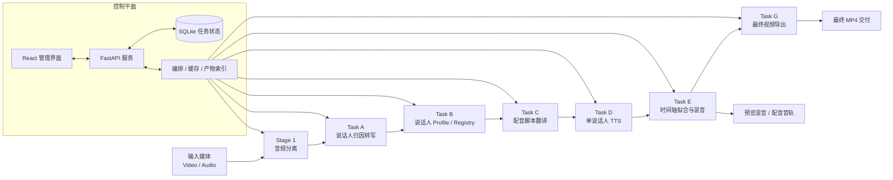

<div align="center">
  
  <h1>translip</h1>
  <p><strong>本地化、多说话人感知的视频配音流水线</strong></p>
  <p>把音频分离、说话人归因转写、翻译、单说话人 TTS、时间轴回贴和视频交付串成一条可复用的端到端流程，并提供 FastAPI + React 管理界面。</p>
  <p>
    
    
    
    
    
  </p>
  <p>
    <a href="#快速开始"><strong>快速开始</strong></a> ·
    <a href="#系统架构"><strong>架构图</strong></a> ·
    <a href="docs/README.md"><strong>文档索引</strong></a> ·
    <a href="frontend/README.md"><strong>前端说明</strong></a> ·
    <a href="README.en.md"><strong>English README</strong></a>
  </p>
</div>

> **当前状态：Beta / Early Access**
>
> `translip` 当前适合研究、实验验证、内部演示、自托管迭代和流程探索。它已经具备端到端链路和管理界面，但定位仍然是快速演进中的 Beta 系统，而不是对外宣称的生产级商业产品。

## 为什么是 `translip`

- **研究路线清晰**：以可拆分的 Stage / Task 管线组织音频分离、转写、翻译、配音、时间轴拟合和交付。
- **多说话人感知**：不仅输出文本，还围绕说话人 profile / registry 建立可复用资产。
- **端到端闭环**：从输入媒体到最终 `mp4` 交付是一条完整链路，不是零散脚本集合。
- **管理界面完整**：提供任务管理、进度追踪、阶段重跑、配置预设和产物下载的 Web UI。
- **本地优先**：适合在本地或自托管环境中调试模型、控制缓存、追踪中间产物。

## 界面预览

| Dashboard | Task Detail |
| --- | --- |
|  |  |

| New Task |
| --- |
|  |

## 系统架构



## 核心能力

- 输入视频或音频，自动分离人声与背景音。
- 基于 `faster-whisper` + `SpeechBrain` 生成带说话人标签的转写结果。
- 为说话人建立 profile / registry，支持跨任务复用。
- 使用本地 `M2M100` 或 `SiliconFlow API` 生成目标语言配音脚本。
- 基于 `Qwen3-TTS` 为每位说话人合成目标语言语音。
- 将配音按原始时间轴回贴，并导出预览版与最终成片。
- 提供任务管理、进度追踪、配置预设和产物下载 Web UI。

## 流水线阶段

| 阶段 | 命令 | 作用 | 主要产物 |
| --- | --- | --- | --- |
| Stage 1 | `translip run` | 音频分离 | `voice.*`、`background.*` |
| Task A | `translip transcribe` | 说话人归因转写 | `segments.zh.json`、`segments.zh.srt` |
| Task B | `translip build-speaker-registry` | 说话人 profile / registry | `speaker_profiles.json`、`speaker_registry.json` |
| Task C | `translip translate-script` | 配音脚本翻译 | `translation.<lang>.json`、`translation.<lang>.srt` |
| Task D | `translip synthesize-speaker` | 单说话人配音合成 | `speaker_segments.<lang>.json`、`speaker_demo.<lang>.wav` |
| Task E | `translip render-dub` | 时间轴拟合与混音 | `dub_voice.<lang>.wav`、`preview_mix.<lang>.wav` |
| Task F | `translip run-pipeline` | 编排 Stage 1 到 Task E | `pipeline-manifest.json`、`pipeline-status.json` |
| Task G | `translip export-video` | 导出最终视频 | `final_preview.<lang>.mp4`、`final_dub.<lang>.mp4` |

## 环境要求

- Python `3.11` 到 `3.12`
- [uv](https://docs.astral.sh/uv/)
- FFmpeg，且已加入 `PATH`
- Node.js + npm
  仅在前端开发或构建管理界面时需要
- macOS 或 Linux
  CPU 可运行，Task D 更推荐 `CUDA` 或 `MPS`

## 安装

基础安装：

```bash
git clone https://github.com/MasamiYui/translip.git
cd translip
uv sync
```

如果你要运行测试或参与开发，建议安装开发依赖：

```bash
uv sync --extra dev
```

推荐提前下载 CDX23 模型：

```bash
uv run translip download-models --backend cdx23 --quality balanced
```

如果要使用 SiliconFlow 翻译后端，还需要设置 API Key：

```bash
export SILICONFLOW_API_KEY=<your-key>
```

## 快速开始

`run-pipeline` 默认会执行到 `task-e`，也就是生成配音音轨和预览混音；最终视频导出需要再执行一次 `export-video`。

```bash
uv run translip run-pipeline \
  --input ./test_video/example.mp4 \
  --output-root ./output-pipeline \
  --target-lang en \
  --write-status
```

导出最终视频：

```bash
uv run translip export-video \
  --pipeline-root ./output-pipeline
```

典型输出目录：

```text
output-pipeline/
├── pipeline-manifest.json
├── pipeline-report.json
├── pipeline-status.json
├── logs/
├── stage1/example/
├── task-a/voice/
├── task-b/voice/
├── task-c/voice/
├── task-d/voice/<speaker-id>/
├── task-e/voice/
└── task-g/delivery/
```

最终成片默认位于：

- `output-pipeline/task-g/delivery/final-preview/final_preview.en.mp4`
- `output-pipeline/task-g/delivery/final-dub/final_dub.en.mp4`

## Web 管理界面

### 开发模式

先启动后端 API：

```bash
uv run uvicorn translip.server.app:app --host 127.0.0.1 --port 8765
```

再启动前端：

```bash
cd frontend
npm install
npm run dev
```

开发环境访问：

- 前端：`http://127.0.0.1:5173`
- 后端 API：`http://127.0.0.1:8765`

说明：

- `frontend/vite.config.ts` 已将 `/api` 代理到 `127.0.0.1:8765`
- 前端使用相对路径访问 API，不需要额外配置前端环境变量

### 构建后由后端托管

先构建前端：

```bash
cd frontend
npm install
npm run build
cd ..
```

然后启动后端：

```bash
uv run translip-server
```

此时如果 `frontend/dist` 存在，后端会自动挂载静态文件，统一从 `http://127.0.0.1:8765` 提供管理界面。

说明：

- `translip-server` 默认监听 `127.0.0.1:8765`
- 如果你需要自定义 host 或 port，请直接使用 `uvicorn translip.server.app:app ...`

## CLI 常用命令

### Stage 1: 音频分离

```bash
uv run translip run \
  --input ./test_video/example.mp4 \
  --mode auto \
  --quality balanced \
  --output-dir ./output-stage1
```

生成示例：

- `./output-stage1/example/voice.wav`
- `./output-stage1/example/background.wav`

### Task A: 语音转写

```bash
uv run translip transcribe \
  --input ./output-stage1/example/voice.wav \
  --output-dir ./output-task-a
```

输出：

- `./output-task-a/voice/segments.zh.json`
- `./output-task-a/voice/segments.zh.srt`
- `./output-task-a/voice/task-a-manifest.json`

### Task B: 说话人注册表

```bash
uv run translip build-speaker-registry \
  --segments ./output-task-a/voice/segments.zh.json \
  --audio ./output-stage1/example/voice.wav \
  --output-dir ./output-task-b \
  --registry ./output-task-b/registry/speaker_registry.json \
  --update-registry
```

### Task C: 翻译

本地 `M2M100`：

```bash
uv run translip translate-script \
  --segments ./output-task-a/voice/segments.zh.json \
  --profiles ./output-task-b/voice/speaker_profiles.json \
  --target-lang en \
  --backend local-m2m100 \
  --output-dir ./output-task-c
```

SiliconFlow API：

```bash
export SILICONFLOW_API_KEY=<your-key>

uv run translip translate-script \
  --segments ./output-task-a/voice/segments.zh.json \
  --profiles ./output-task-b/voice/speaker_profiles.json \
  --target-lang en \
  --backend siliconflow \
  --api-model deepseek-ai/DeepSeek-V3 \
  --output-dir ./output-task-c
```

### Task D: 单说话人合成

```bash
uv run translip synthesize-speaker \
  --translation ./output-task-c/voice/translation.en.json \
  --profiles ./output-task-b/voice/speaker_profiles.json \
  --speaker-id spk_0000 \
  --output-dir ./output-task-d \
  --device auto
```

### Task E: 时间轴拟合与混音

```bash
uv run translip render-dub \
  --background ./output-stage1/example/background.wav \
  --segments ./output-task-a/voice/segments.zh.json \
  --translation ./output-task-c/voice/translation.en.json \
  --task-d-report ./output-task-d/voice/spk_0000/speaker_segments.en.json \
  --output-dir ./output-task-e \
  --fit-policy conservative \
  --mix-profile preview
```

如果有多个说话人，需要多次传入 `--task-d-report`。

### Task G: 最终视频导出

```bash
uv run translip export-video \
  --pipeline-root ./output-pipeline
```

### 其他命令

- `uv run translip probe --input <path>`
  查看媒体信息
- `uv run translip download-models --backend cdx23 --quality balanced`
  预下载模型

## 配置与环境变量

| 变量 | 默认值 | 用途 |
| --- | --- | --- |
| `TRANSLIP_CACHE_DIR` | `~/.cache/translip` | 模型缓存、状态文件等根目录 |
| `TRANSLIP_DB_PATH` | `~/.cache/translip/data.db` | Web 管理界面的 SQLite 数据库位置 |
| `SILICONFLOW_API_KEY` | 无 | 启用 `siliconflow` 翻译后端时必需 |
| `SILICONFLOW_BASE_URL` | `https://api.siliconflow.cn/v1` | 覆盖 SiliconFlow API 地址 |
| `SILICONFLOW_MODEL` | `deepseek-ai/DeepSeek-V3` | 覆盖默认 SiliconFlow 模型 |

更细的默认参数可以查看 [src/translip/config.py](src/translip/config.py)。

## 开发

后端开发与测试：

```bash
uv sync --extra dev
uv run pytest
```

前端开发与构建：

```bash
cd frontend
npm install
npm run lint
npm run build
```

## 相关文档

- [docs/README.md](docs/README.md)：文档总索引
- [docs/speaker-aware-dubbing-plan.md](docs/speaker-aware-dubbing-plan.md)：整体方案与技术路线
- [docs/speaker-aware-dubbing-task-breakdown.md](docs/speaker-aware-dubbing-task-breakdown.md)：任务拆解与里程碑
- [docs/task-f-pipeline-and-engineering-orchestration.md](docs/task-f-pipeline-and-engineering-orchestration.md)：编排与缓存设计
- [docs/task-g-final-video-delivery.md](docs/task-g-final-video-delivery.md)：最终视频交付设计
- [docs/frontend-management-system-design.md](docs/frontend-management-system-design.md)：管理界面设计
- [frontend/README.md](frontend/README.md)：前端目录与开发说明

## English README

- [README.en.md](README.en.md)：完整英文版说明
