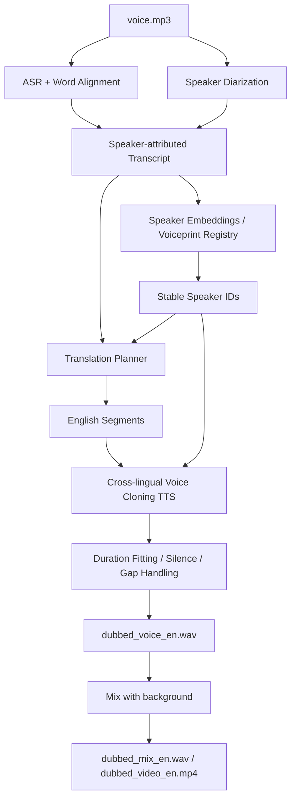

# 说话人识别、声纹建档与跨语种配音流水线规划

- 项目: `video-voice-separate`
- 文档状态: Draft v1
- 调研日期: 2026-04-11
- 目标: 基于上游输出的 `voice.mp3`，完成多人识别、声纹建档、中文转英文、英文声音克隆与配音替换，服务“出海视频”场景

## 1. 背景

当前项目已经有第一条流水线:

- 输入视频/音频
- 输出 `voice` 和 `background`

下一条流水线的输入将是:

- `voice.mp3` 或 `voice.wav`

目标输出将是:

- 带说话人标签的中文转写
- 可跨视频复用的说话人声纹档案
- 英文翻译文本
- 使用原说话人音色克隆出的英文语音
- 与背景音重新混合后的英文配音音轨
- 后续可进一步合成出英文版本视频

这条链路比源分离复杂很多，因为它本质上是五个问题的组合:

1. `ASR`: 识别“说了什么”
2. `Diarization`: 识别“谁在什么时候说话”
3. `Speaker ID / Voiceprint`: 识别“这个人是谁”，并建立稳定声纹
4. `Translation`: 把中文改写成适合配音的英文
5. `Voice Cloning / Dubbing`: 用原说话人音色生成英文，并回填时间线

## 2. 核心结论

截至 **2026-04-11**，我不建议第一版直接押注“端到端语音到语音翻译”模型来做整条链路。

推荐原因:

- 端到端模型很强，但可控性差
- 说话人一致性、术语一致性、字幕可编辑性、人工校对都更难
- 你要做的是“视频出海生产流水线”，不是单次 demo

因此，**V1 应采用模块化级联方案**:

`voice.mp3 -> ASR + diarization -> 说话人归因文本 -> 声纹建档 -> 英文翻译 -> 英文声音克隆 -> 时间线贴合 -> 与 background 混音`

这是最适合做成产品和长期演进的路线。

## 3. 产品目标与非目标

### 3.1 目标

- 输入: 上游分离后的人声轨
- 输出:
  - `transcript.zh.json`
  - `speaker_profiles.json`
  - `translation.en.json`
  - `dubbed_voice_en.wav`
  - `dubbed_mix_en.wav`
  - 后续可扩展 `dubbed_video_en.mp4`
- 支持多人说话
- 支持说话人跨片段聚类
- 支持声纹登记与跨视频复用
- 支持中文转英文后，用原音色生成英文

### 3.2 非目标

- V1 不做实时直播翻译
- V1 不做完全自动 lip-sync
- V1 不做法律意义上的高安全声纹认证
- V1 不做“一键全自动无人工复核”的商业发布流程

备注:

- 这里的“声纹”首先用于 **媒体制作中的说话人一致性建档**，不是金融/门禁那种高安全认证场景。

## 4. 调研结论

## 4.1 ASR 层

### `Whisper / WhisperX`

- OpenAI Whisper 官方仓库仍然是通用 ASR 里最稳的开源基线之一:
  - [openai/whisper](https://github.com/openai/whisper)
- WhisperX 在 Whisper 之上补上了更适合生产的能力:
  - 词级时间戳
  - 强制对齐
  - 说话人分离集成
  - [m-bain/whisperX](https://github.com/m-bain/whisperX)

工程判断:

- 如果 V1 目标是“先把 speaker-attributed transcript 做稳”，`WhisperX` 仍然是最合适的工程基线。
- 它不是最新模型，但它把 `ASR + 对齐 + diarization` 这一套链路串得最实用。

### `SenseVoice`

- 阿里 FunAudioLLM 的 `SenseVoice` 定位是多语种语音理解模型:
  - [FunAudioLLM/SenseVoice](https://github.com/FunAudioLLM/SenseVoice)
  - [FunAudioLLM 技术报告](https://arxiv.org/abs/2407.04051)
- 官方仓库给出的能力包括:
  - 50+ 语言
  - 400,000+ 小时训练数据
  - 情绪识别和事件识别

工程判断:

- 如果你的主战场是 **中文内容**，`SenseVoice` 很值得作为 V1.1 的中文 ASR 备选。
- 但它本身不等于“说话人归因流水线”，仍然需要外部 diarization 和 speaker embedding。

### `NVIDIA Parakeet / NeMo`

- NVIDIA NeMo 在 ASR 和 speaker diarization 上都很强:
  - [NVIDIA-NeMo/NeMo](https://github.com/NVIDIA-NeMo/NeMo)
  - [NeMo diarization models docs](https://docs.nvidia.com/nemo-framework/user-guide/latest/nemotoolkit/asr/speaker_diarization/models.html)

工程判断:

- NeMo 很适合做性能和研究分支
- 但第一版如果你要最快做出可维护产品，仍建议先用 `WhisperX + pyannote + speaker embedding`

## 4.2 Speaker Diarization 层

### `pyannote.audio`

- `pyannote.audio` 目前仍是开源说话人分离工具链中最成熟的一支:
  - [pyannote/pyannote-audio](https://github.com/pyannote/pyannote-audio)
- 官方 README 直接提供了 `community-1` 开源 diarization pipeline，并给出 benchmark 和速度数据。

工程判断:

- **V1 默认 diarization 选型: `pyannote/speaker-diarization-community-1`**
- 原因:
  - 开源可本地跑
  - 文档齐
  - 与 WhisperX 集成路径成熟
  - 输出结构清晰，适合后续 speaker mapping

### `NVIDIA Sortformer`

- `Sortformer` 是 2024 提出、2025 ICML 发表的更近期方法:
  - [Sortformer paper](https://arxiv.org/abs/2409.06656)
- NVIDIA 也在 NeMo 中公开了相关 diarization pipeline 配置和组件。

工程判断:

- `Sortformer` 更值得作为 **研究和性能升级路线**
- 但第一版不建议先用它替代 pyannote，因为你当前优先级是“把链路做出来并可 debug”

### `3D-Speaker Toolkit`

- 阿里的 `3D-Speaker-Toolkit` 同时覆盖:
  - speaker verification
  - speaker recognition
  - speaker diarization
  - [modelscope/3D-Speaker](https://github.com/modelscope/3D-Speaker)
  - [3D-Speaker-Toolkit paper](https://arxiv.org/abs/2403.19971)

工程判断:

- 它更像一个“说话人能力工具箱”，很适合做声纹建档和说话人识别
- 在你的场景里，我更建议用它做 **speaker embedding / identification**，而不是直接替换 V1 的 diarization 主链

## 4.3 声纹与说话人识别层

### `CAM++`

- `CAM++` 是阿里语音实验室提出的 speaker verification 模型:
  - [CAM++ paper](https://arxiv.org/abs/2303.00332)
- 3D-Speaker / ModelScope 生态中已经有现成实现与模型。

工程判断:

- **V1 默认声纹 embedding 选型: `CAM++`**
- 原因:
  - 计算开销小
  - 推理快
  - 很适合做视频制作场景里的 speaker registry

### `WeSpeaker`

- WeNet 团队的 `WeSpeaker` 覆盖 speaker embedding、similarity、diarization:
  - [wenet-e2e/wespeaker](https://github.com/wenet-e2e/wespeaker)

工程判断:

- `WeSpeaker` 可以作为 V1 的平替或 fallback
- 如果我们希望依赖更纯、接口更直接，它是不错的工程选项

### 为什么“声纹”和“说话人聚类”要拆开

原因:

- diarization 的输出通常只是 `SPEAKER_00 / SPEAKER_01`
- 真正产品里你还需要:
  - 把 `SPEAKER_00` 映射成稳定的 `speaker_id`
  - 让同一个人跨视频保持一致
  - 支持“已知说话人库”的匹配与人工确认

因此:

- `diarization` 负责切分说话时段
- `voiceprint / speaker ID` 负责稳定命名和跨视频追踪

## 4.4 翻译层

### `NLLB-200`

- Meta 的 `No Language Left Behind` 是通用多语种 MT 重要基线:
  - [paper](https://arxiv.org/abs/2207.04672)
  - [facebookresearch/fairseq](https://github.com/facebookresearch/fairseq)

工程判断:

- 对 `zh -> en` 这种高资源语对，`NLLB-200` 可以作为开源本地翻译基线
- 但视频配音不是纯 MT 任务，还需要“可配音性改写”

### `SeamlessM4T v2 / SeamlessExpressive`

- Meta `seamless_communication` 同时支持:
  - speech-to-speech
  - speech-to-text
  - text-to-speech translation
  - text-to-text
  - ASR
  - [facebookresearch/seamless_communication](https://github.com/facebookresearch/seamless_communication)
  - [Seamless paper](https://arxiv.org/abs/2312.05187)

工程判断:

- `Seamless` 非常适合做研究分支和 end-to-end 对比
- 但 **V1 不建议把翻译和配音完全交给 end-to-end speech translation**
- 你需要可编辑文本、术语表、人工 QA，这些在模块化方案里更容易

### 翻译层的正确产品定位

推荐做法:

- 先出 **可编辑中文转写**
- 再出 **可编辑英文翻译脚本**
- 最后才走 TTS

原因:

- 术语、品牌名、字幕节奏、平台风格都需要人工或规则介入
- “直译正确”不等于“适合英文视频配音”

## 4.5 语音克隆 / TTS 层

### `CosyVoice / CosyVoice 2 / CosyVoice 3`

- 阿里 FunAudioLLM 的 `CosyVoice` 系列是当前最值得重点关注的开源方案之一:
  - [FunAudioLLM/CosyVoice](https://github.com/FunAudioLLM/CosyVoice)
  - [CosyVoice paper](https://arxiv.org/abs/2407.05407)
  - [CosyVoice 2 paper](https://arxiv.org/abs/2412.10117)
- 官方仓库已经同时提供:
  - CosyVoice 1/2/3
  - cross-lingual zero-shot voice cloning
  - 更面向生产的 text normalization 和 controllability

工程判断:

- **V1 默认英文配音后端推荐: `CosyVoice2-0.5B`**
- **V1.1 升级路线: `Fun-CosyVoice3-0.5B`**

这样选的原因:

- `CosyVoice2` 足够新，且对多语种/跨语种克隆定位清晰
- `CosyVoice3` 更强，但第一版可以等基线链路稳定后再 benchmark

### `OpenVoice V2`

- `OpenVoice` 是 MIT + MyShell 的即时声音克隆方案:
  - [myshell-ai/OpenVoice](https://github.com/myshell-ai/OpenVoice)
  - [OpenVoice paper](https://arxiv.org/abs/2312.01479)
- 官方 README 明确写到 OpenVoice V2:
  - 音质更好
  - 原生多语种支持
  - MIT license，支持商业使用

工程判断:

- **OpenVoice V2 是很好的 fallback / 快速验证后端**
- 如果 `CosyVoice2` 环境或依赖太重，可以先用 `OpenVoice V2` 快速落地

### `F5-TTS`

- `F5-TTS` 是 2024 下半年到 2025 很热的开源 TTS 路线:
  - [SWivid/F5-TTS](https://github.com/SWivid/F5-TTS)
  - [F5-TTS paper](https://arxiv.org/abs/2410.06885)

工程判断:

- `F5-TTS` 很值得加入评测矩阵
- 但对“中文说话人 -> 英文配音”的生产链路，**CosyVoice / OpenVoice 的角色定义更直接**

## 4.6 端到端 S2ST 研究分支

### `SeamlessExpressive / Hibiki`

- `SeamlessExpressive` 关注表达力和 voice style transfer
- `Hibiki` 是 Kyutai 的实时 speech-to-speech translation 路线:
  - [kyutai-labs/hibiki](https://github.com/kyutai-labs/hibiki)
  - [Hibiki paper](https://arxiv.org/abs/2502.03382)

工程判断:

- 这些模型适合做 **R&D 分支**
- 但不建议拿来替代 V1 的生产级可控流水线

## 5. 推荐架构

## 5.1 总体架构



## 5.2 V1 推荐技术栈

- ASR + 对齐:
  - `WhisperX`
- Speaker diarization:
  - `pyannote/speaker-diarization-community-1`
- Speaker embedding / voiceprint:
  - `CAM++` via `3D-Speaker`
- Translation:
  - 开源 baseline: `NLLB-200`
  - 产品增强: 可插拔 LLM / glossary post-edit
- Cross-lingual TTS:
  - 默认: `CosyVoice2-0.5B`
  - fallback: `OpenVoice V2`
- 音频拼接与导出:
  - `FFmpeg`

## 5.3 为什么先选这套

- 每一层都有成熟开源实现
- 多数模块都可本地运行
- 每一层都可单独评测与替换
- 出问题时能定位是 ASR、diarization、translation 还是 TTS

## 6. 分阶段实施计划

## M1: Speaker-attributed Transcript

输入:

- `voice.mp3`

输出:

- `transcript.zh.json`
- `transcript.zh.srt`

实现内容:

- 用 `WhisperX` 做中文转写和词级时间戳
- 用 `pyannote` 做 diarization
- 合并为带 speaker label 的 segment 列表

验收标准:

- 至少输出:
  - `start`
  - `end`
  - `speaker_tmp_id`
  - `text_zh`
  - `words`

## M2: Speaker Registry / Voiceprint

输入:

- M1 的 speaker segments

输出:

- `speaker_profiles.json`
- `speakers/<speaker_id>/embedding.npy`
- `speakers/<speaker_id>/reference.wav`

实现内容:

- 抽取每个 speaker cluster 的代表片段
- 用 `CAM++` 生成 embedding
- 建立说话人库
- 支持:
  - 新建 speaker
  - speaker merge
  - speaker rename
  - 跨视频 speaker match

验收标准:

- 同一视频内同一人的片段能稳定归并
- 可人工把 `speaker_tmp_id` 绑定到稳定 `speaker_id`

## M3: Translation Planner

输入:

- 带 speaker 的中文 transcript

输出:

- `translation.en.json`

实现内容:

- 中文断句与重分段
- 英文翻译
- glossary / 专有名词替换
- 生成适合配音的英文句子

验收标准:

- 每个 segment 至少包含:
  - `speaker_id`
  - `text_zh`
  - `text_en_raw`
  - `text_en_dub`
  - `target_duration_sec`

## M4: English Voice Cloning

输入:

- `translation.en.json`
- `speaker_profiles.json`

输出:

- `dub_segments/<speaker_id>/<segment_id>.wav`
- `dubbed_voice_en.wav`

实现内容:

- 以每个 speaker 的参考语音做跨语种声音克隆
- 优先接入 `CosyVoice2`
- fallback 接 `OpenVoice V2`

验收标准:

- 多个 speaker 可分别使用各自音色
- 生成英文时 speaker timbre 尽量稳定

## M5: Timing Fit & Mix

输入:

- 逐段英文配音
- `background.wav`

输出:

- `dubbed_mix_en.wav`
- 后续 `dubbed_video_en.mp4`

实现内容:

- 根据原始时间线拼接英文片段
- 处理静音、间隔、淡入淡出
- 必要时做轻微时间拉伸
- 和背景声重混

验收标准:

- 不明显爆音
- 片段之间没有明显 click/pop
- 总时长与原视频对齐

## M6: QA 与回修工具

输出:

- `review.json`

实现内容:

- 标记:
  - speaker uncertainty
  - duration overflow
  - TTS failure
  - 翻译过长或术语不一致
- 支持人工修 speaker 映射和英文文本后重跑局部段

## 7. 推荐目录与数据契约

建议新增目录:

```text
src/video_voice_separate/
  asr/
    whisperx_runner.py
    alignment.py
  speaker/
    diarizer.py
    embedder.py
    registry.py
    matching.py
  translation/
    translator.py
    glossary.py
    segmentation.py
  dubbing/
    cosyvoice_backend.py
    openvoice_backend.py
    scheduler.py
    mux.py
  pipeline/
    speaker_asr.py
    dubbing_pipeline.py
```

建议任务目录:

```text
output/
  <video_name>/
    source/
      voice.wav
      background.wav
    transcript/
      transcript.zh.json
      transcript.zh.srt
    speakers/
      speaker_profiles.json
      speaker_00/
        embedding.npy
        reference.wav
    translation/
      translation.en.json
    dubbing/
      dub_segments/
      dubbed_voice_en.wav
      dubbed_mix_en.wav
    manifest.json
```

## 8. 模块选型建议

## 8.1 第一阶段默认实现

推荐顺序:

1. `WhisperX`
2. `pyannote`
3. `3D-Speaker / CAM++`
4. `NLLB-200` 或翻译接口占位
5. `CosyVoice2`

原因:

- 先把 speaker-attributed transcript 做出来，后面的每一步才有稳定输入
- “谁说了什么”比“怎么配英文音”更基础

## 8.2 第二阶段对比实验

做横向 benchmark:

- ASR:
  - `WhisperX`
  - `SenseVoice`
  - `Parakeet/NeMo`
- Speaker:
  - `pyannote + CAM++`
  - `pyannote + WeSpeaker`
  - `NeMo Sortformer + TitaNet`
- TTS:
  - `CosyVoice2`
  - `OpenVoice V2`
  - `F5-TTS`

## 9. 评测方案

## 9.1 数据集

建议准备三类真实样本:

1. 单人中文口播
2. 双人/多人访谈
3. 综艺/剧情类复杂对白

每类至少 5 段。

## 9.2 指标

### ASR

- CER / WER
- 对齐误差

### Speaker Diarization

- DER
- speaker count accuracy
- cluster purity

### Voiceprint

- speaker retrieval accuracy
- top-1 matching accuracy
- 同人跨视频稳定性

### Translation

- BLEU / COMET 只做参考
- 重点看可配音性、专有名词正确性、人工接受度

### TTS / Voice Cloning

- speaker similarity
- intelligibility
- 英文自然度
- 目标时长匹配率

### Final Dub

- 总时长对齐率
- 片段重叠率
- 人工听感评分

## 10. 风险与应对

## 10.1 说话人切分不准

表现:

- 一个 speaker 被切成多个 cluster
- 多个 speaker 被误合并

应对:

- diarization 和 voiceprint 分层
- 允许人工 merge/split
- 建 speaker registry 而不是只靠临时 label

## 10.2 英文翻译过长

表现:

- 英文配音超出原时长

应对:

- 翻译阶段输出 `text_en_raw` 和 `text_en_dub`
- `text_en_dub` 专门做“短句化、口语化、适合配音”

## 10.3 跨语种克隆失真

表现:

- 英文口音怪
- timbre 相似但内容不稳

应对:

- 先 benchmark `CosyVoice2 / OpenVoice V2 / F5-TTS`
- 参考语音片段做质量过滤
- 单 speaker 选高 SNR、情绪稳定的 reference

## 10.4 法律与平台风险

表现:

- 未授权声音克隆
- 发布平台判定为误导性合成媒体

应对:

- 明确记录声纹与声音克隆授权
- 对外发布时保留审计记录
- 预留 watermark / disclosure 能力

## 11. 最终推荐方案

第一版推荐直接落地的路线是:

- Speaker-attributed ASR:
  - `WhisperX + pyannote`
- 声纹建档:
  - `3D-Speaker / CAM++`
- 翻译:
  - `NLLB-200` 或可插拔翻译接口
- 英文声音克隆:
  - `CosyVoice2`
- 轻量 fallback:
  - `OpenVoice V2`

这条路线的优点:

- 每个模块都有成熟开源实现
- 工程边界清晰
- 便于人工复核
- 后续容易替换成更强模型

## 12. 下一步建议

下一步不要直接做整条英文配音链。

正确顺序是:

1. 先实现 **M1: speaker-attributed transcript**
2. 再实现 **M2: speaker registry / voiceprint**
3. 然后再接 **translation + TTS**

原因:

- 如果“谁说了什么”不稳定，后面的翻译和配音都会错位
- 先把 speaker-aware transcript 做稳，是整条产品链最关键的基座

## 13. 主要参考

- ASR:
  - [openai/whisper](https://github.com/openai/whisper)
  - [m-bain/whisperX](https://github.com/m-bain/whisperX)
  - [FunAudioLLM/SenseVoice](https://github.com/FunAudioLLM/SenseVoice)
  - [FunAudioLLM report](https://arxiv.org/abs/2407.04051)
- Diarization / Speaker:
  - [pyannote/pyannote-audio](https://github.com/pyannote/pyannote-audio)
  - [NVIDIA NeMo diarization docs](https://docs.nvidia.com/nemo-framework/user-guide/latest/nemotoolkit/asr/speaker_diarization/models.html)
  - [Sortformer](https://arxiv.org/abs/2409.06656)
  - [3D-Speaker](https://github.com/modelscope/3D-Speaker)
  - [3D-Speaker-Toolkit paper](https://arxiv.org/abs/2403.19971)
  - [WeSpeaker](https://github.com/wenet-e2e/wespeaker)
  - [CAM++](https://arxiv.org/abs/2303.00332)
- Translation / S2ST:
  - [NLLB](https://arxiv.org/abs/2207.04672)
  - [Seamless Communication](https://github.com/facebookresearch/seamless_communication)
  - [Seamless paper](https://arxiv.org/abs/2312.05187)
  - [Hibiki](https://github.com/kyutai-labs/hibiki)
  - [Hibiki paper](https://arxiv.org/abs/2502.03382)
- Voice cloning / TTS:
  - [CosyVoice](https://github.com/FunAudioLLM/CosyVoice)
  - [CosyVoice paper](https://arxiv.org/abs/2407.05407)
  - [CosyVoice 2 paper](https://arxiv.org/abs/2412.10117)
  - [OpenVoice](https://github.com/myshell-ai/OpenVoice)
  - [OpenVoice paper](https://arxiv.org/abs/2312.01479)
  - [F5-TTS](https://github.com/SWivid/F5-TTS)
  - [F5-TTS paper](https://arxiv.org/abs/2410.06885)
