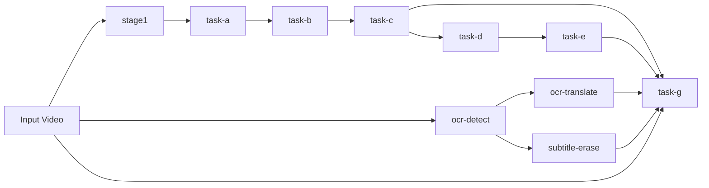

# Template-Driven Constrained DAG Workflow Design

Date: 2026-04-15

## Summary

Upgrade the current linear `stage1 -> task-a -> ... -> task-g` pipeline model into a template-driven, constrained DAG workflow model.

The system will remain simple for users:

- Users choose a technical-combination template.
- The template expands into an execution subgraph.
- The orchestrator resolves dependencies, executes nodes in topological order, reuses cached artifacts, and records node-level status.

The system will become more accurate internally:

- Audio dubbing remains the primary spine and stays ASR-driven.
- OCR becomes a parallel subtitle asset line, not a replacement for ASR dubbing.
- Hard-subtitle erasure becomes a separate optional video-cleanup line driven by OCR detection results.
- Delivery consumes existing assets and assembles the requested outputs; it does not secretly trigger missing upstream work.

## Context

The current repository already has a strong separation of responsibilities:

- `stage1` through `task-e` form the audio dubbing spine.
- `task-g` is the final delivery and video export layer.
- The server and frontend already understand staged execution, cache reuse, manifests, and progress tracking.

Two sibling projects introduce additional capabilities that matter for translation quality and delivery quality:

- `subtitle-ocr`
  - detects hard subtitles from the input video
  - can output subtitle timing, text, geometry, and SRT/JSON data
- `video-subtitle-erasure`
  - removes original hard subtitles from the input video
  - depends on OCR-derived subtitle timing and geometry

The user requirements from this discussion are:

- Dubbing must remain ASR-driven.
- Final display subtitles should support both ASR-derived and OCR-derived outputs.
- Original hard-subtitle erasure is optional.
- The overall system should be modeled as a graph, not just a single fixed line.
- The first public workflow surface should use templates, not arbitrary user-authored graph editing.
- OCR should be represented as three distinct nodes:
  - `ocr-detect`
  - `ocr-translate`
  - `subtitle-erase`
- Templates should support mixed execution semantics:
  - `required` nodes
  - `optional` nodes

## Goals

- Model the workflow as a constrained DAG instead of a fixed linear stage list.
- Preserve the current audio dubbing spine and its output contracts.
- Add OCR and subtitle-erasure capabilities as first-class workflow nodes.
- Keep the user-facing entrypoint template-based rather than graph-editor-based.
- Support technical-combination templates with stable, testable execution behavior.
- Allow delivery outputs to choose from:
  - ASR-based subtitles
  - OCR-based subtitles
  - both
  - neither
- Allow optional clean-video delivery when subtitle erasure is enabled.
- Reuse one orchestration system for planning, execution, cache reuse, manifests, logs, and progress.

## Non-Goals

- A general-purpose user-authored workflow editor in v1.
- Arbitrary plugin-defined nodes from the UI in v1.
- Replacing ASR with OCR for dubbing or TTS script generation.
- Hiding OCR execution inside `task-g`.
- Letting node implementations communicate through ad hoc in-process data instead of declared artifacts.
- Converting the entire codebase into a distributed job scheduler.

## Core Decisions

This design locks in the following decisions:

- The internal model is a constrained DAG.
- The user-facing execution surface is a template registry.
- Templates are defined by technical combinations first; user-facing friendly names can be added later.
- OCR is a parallel subtitle asset line and does not replace ASR in the dubbing spine.
- `subtitle-erase` depends on `ocr-detect` output and must not run its own hidden OCR pass.
- New OCR-related capabilities become first-class workflow nodes in the unified node system.
- Templates use mixed execution semantics:
  - `required` node failure fails the workflow
  - `optional` node failure does not fail the main workflow, but the final report must mark partial success
- `task-g` remains a delivery assembler and does not implicitly trigger missing upstream nodes.

## Mental Model

The system should be described in three layers:

1. **Capability Graph**
   - A unified graph of registered workflow nodes and their declared dependencies.
2. **Template**
   - A named technical combination that selects a subgraph and sets default policies.
3. **Execution Plan**
   - A concrete, resolved, topologically ordered plan produced by expanding a template against the capability graph and request config.

This preserves a simple external UX while allowing the internals to evolve from a fixed line into a real dependency graph.

## Workflow Architecture



The graph is constrained:

- It is acyclic.
- Dependencies are declared statically in code.
- Nodes communicate through standard artifacts.
- Templates select subgraphs from this declared capability graph.

## Node Taxonomy

Nodes fall into four groups.

### 1. Audio Spine Nodes

These remain the primary translation and dubbing path.

- `stage1`
- `task-a`
- `task-b`
- `task-c`
- `task-d`
- `task-e`

Responsibilities:

- extract and separate audio
- transcribe speech with speaker attribution
- build speaker assets
- translate dubbing scripts
- synthesize target-language speech
- fit timing and mix final audio

This line remains the default spine for any dubbing workflow.

### 2. OCR Subtitle Asset Nodes

These create subtitle assets from on-screen hard subtitles.

- `ocr-detect`
- `ocr-translate`

Responsibilities:

- detect subtitle events, timing, and geometry from video frames
- translate OCR subtitle text for final display subtitle outputs

These nodes are display-subtitle-oriented and must not replace ASR-derived dubbing semantics.

### 3. Video Cleanup Nodes

- `subtitle-erase`

Responsibilities:

- remove original hard subtitles from the source video using OCR timing and geometry
- emit a clean-video asset for downstream delivery

This node changes only the video base layer, not the dubbing or subtitle semantics.

### 4. Delivery Nodes

- `task-g`

Responsibilities:

- choose the correct video base
- choose the correct audio asset
- attach or export requested subtitle outputs
- emit final delivery artifacts and delivery manifests

If a template does not request dubbed audio, `task-g` may pass through the original audio from the input video.

`task-g` is an assembler, not a hidden planner for upstream computation.

## First-Class Node Registry

The existing fixed stage list should be replaced by a registry of workflow node definitions.

Each node definition should declare:

- `node_name`
- `group`
- `dependencies`
- `default_required`
- `artifact_contract`
- `cache_inputs`
- `runner_kind`
- `log_name`
- `manifest_name`

### Required Registry Behavior

- Dependency resolution is graph-based, not list-slice-based.
- Every node has a stable ID and artifact contract.
- Every node can be shown in status views and logs.
- The planner can compute the full transitive closure for any selected template.
- Existing nodes and new OCR nodes use the same orchestration primitives.

## Initial Node Set and Dependencies

The initial graph for this design is:

- `stage1`
  - depends on: `input-video`
- `task-a`
  - depends on: `stage1`
- `task-b`
  - depends on: `stage1`, `task-a`
- `task-c`
  - depends on: `task-a`, `task-b`
- `task-d`
  - depends on: `task-c`, `task-b`
- `task-e`
  - depends on: `stage1`, `task-a`, `task-c`, `task-d`
- `ocr-detect`
  - depends on: `input-video`
- `ocr-translate`
  - depends on: `ocr-detect`
- `subtitle-erase`
  - depends on: `input-video`, `ocr-detect`
- `task-g`
  - depends on:
    - `input-video`
    - selected delivery assets resolved from policy:
      - `task-e` when dubbed audio is requested
      - `task-c` when ASR subtitle export is requested
      - `ocr-translate` when OCR subtitle export is requested
      - `subtitle-erase` when clean-video delivery is requested

Important clarification:

- ASR-derived translated display subtitles are produced from the existing audio spine, primarily through `task-c` artifacts.
- OCR-derived translated display subtitles are produced by `ocr-translate`.
- Both are valid subtitle sources for delivery.

## Artifact Contracts

Node boundaries must be artifact-based. No downstream node should need to inspect the internals of an upstream implementation.

### Audio Spine Assets

The current artifact contracts remain authoritative.

Examples:

- `stage1`
  - `voice.*`
  - `background.*`
  - `manifest.json`
- `task-a`
  - `segments.<lang>.json`
  - `segments.<lang>.srt`
  - `task-a-manifest.json`
- `task-c`
  - `translation.<target>.json`
  - `translation.<target>.editable.json`
  - `translation.<target>.srt`
  - `task-c-manifest.json`
- `task-e`
  - `dub_voice.<target>.wav`
  - `preview_mix.<target>.wav`
  - `timeline.<target>.json`
  - `task-e-manifest.json`

### New OCR Assets

#### `ocr-detect`

Recommended bundle:

- `ocr-detect/`
  - `ocr_events.json`
  - `ocr_events.srt`
  - `ocr_regions.json`
  - `ocr-detect-manifest.json`
  - `debug/` optional

`ocr_events.json` should be the canonical downstream input.

It should contain at least:

- `event_id`
- `start`
- `end`
- `text`
- `confidence`
- `language`
- `geometry`
  - `box`
  - `polygon`
  - `rotated_box` when available
- `source`
  - `engine`
  - `sample_interval`
  - `position_mode`

The important contract is event-level data, not raw frame dumps.

#### `ocr-translate`

Recommended bundle:

- `ocr-translate/`
  - `ocr_subtitles.<target>.json`
  - `ocr_subtitles.<target>.srt`
  - `ocr-translate-manifest.json`

This node consumes `ocr_events.json` and produces translated subtitle assets for display/export.

#### `subtitle-erase`

Recommended bundle:

- `subtitle-erase/`
  - `clean_video.<target-container>`
  - `erase_report.json`
  - `subtitle-erase-manifest.json`
  - `debug/` optional

This node consumes the input video and `ocr_events.json` and produces a clean-video base layer.

### Delivery Assets

`task-g` should continue to emit final delivery bundles, but now with clearer subtitle and video-source distinctions.

Recommended outputs:

- `final_preview.<target>.mp4`
- `final_dub.<target>.mp4`
- `delivery-manifest.json`
- `delivery-report.json`
- sidecar subtitles when requested:
  - `final_preview.<target>.asr.srt`
  - `final_preview.<target>.ocr.srt`
  - `final_dub.<target>.asr.srt`
  - `final_dub.<target>.ocr.srt`

The first version should prefer sidecar subtitle output over exploding the number of burned-in mp4 variants.

## Template Model

Templates are the public workflow abstraction.

Each template definition should declare:

- `template_id`
- `description`
- `entry_nodes`
- `required_nodes`
- `optional_nodes`
- `default_delivery_policy`
- `default_parameter_preset`
- `expected_artifacts`

### Template Expansion Rules

When a template is selected:

1. Take the declared template nodes.
2. Compute the transitive dependency closure using the node registry.
3. Mark nodes as required or optional according to the template.
4. Apply default parameter presets.
5. Produce a resolved execution plan.

This means templates define intent, while the planner defines the concrete node-level plan.

## Initial Template Catalog

The first version should keep the template set intentionally small.

### 1. `asr-dub-basic`

Purpose:

- baseline dubbing pipeline

Nodes:

- required:
  - `stage1`
  - `task-a`
  - `task-b`
  - `task-c`
  - `task-d`
  - `task-e`
  - `task-g`

Delivery defaults:

- audio: `preview_mix` and `dub_voice`
- subtitle source: `asr`
- clean video: disabled

### 2. `asr-dub+ocr-subs`

Purpose:

- dubbing plus OCR-derived display subtitle assets

Nodes:

- required:
  - `stage1`
  - `task-a`
  - `task-b`
  - `task-c`
  - `task-d`
  - `task-e`
  - `ocr-detect`
  - `ocr-translate`
  - `task-g`

Delivery defaults:

- subtitle source: `both`
- clean video: disabled

### 3. `asr-dub+ocr-subs+erase`

Purpose:

- dubbing, OCR subtitle outputs, and clean-video delivery

Nodes:

- required:
  - `stage1`
  - `task-a`
  - `task-b`
  - `task-c`
  - `task-d`
  - `task-e`
  - `ocr-detect`
  - `task-g`
- optional:
  - `ocr-translate`
  - `subtitle-erase`

Delivery defaults:

- subtitle source: `asr` or `both`, depending on whether `ocr-translate` succeeds
- clean video: `clean_if_available`

This is the first template where partial-success semantics are intentionally valuable.

### 4. `ocr-subs+erase-only`

Purpose:

- subtitle-focused workflow without dubbing

Nodes:

- required:
  - `ocr-detect`
  - `task-g`
- optional:
  - `ocr-translate`
  - `subtitle-erase`

Delivery defaults:

- audio source: `original`
- video base: `original` or `clean_if_available`
- subtitle outputs: `ocr` when available

This template is useful, but it can be deferred if the first implementation scope needs to stay tighter.

## Required vs Optional Execution Semantics

Templates use mixed execution semantics.

### Required Nodes

- A required node failure fails the workflow.
- Downstream nodes that depend on it are not executed.
- The workflow report status becomes `failed`.

### Optional Nodes

- An optional node failure does not fail the main workflow if no required downstream node depends exclusively on it.
- The workflow report becomes `partial_success` when the main required path succeeds but one or more optional nodes fail.
- Delivery may still complete by applying fallback policies.

### Example

For `asr-dub+ocr-subs+erase`:

- If `ocr-detect` fails, the workflow fails because `subtitle-erase` and `ocr-translate` cannot be meaningfully resolved, and the template explicitly requires OCR detection.
- If `ocr-translate` fails but `subtitle-erase` and the audio spine succeed, delivery can still complete with ASR subtitles only.
- If `subtitle-erase` fails but the audio spine and subtitle assets succeed, delivery can still complete on the original video base.

## Delivery Policy

`task-g` should accept an explicit delivery policy rather than embedding hidden heuristics.

Recommended policy fields:

- `video_source`
  - `original`
  - `clean`
  - `clean_if_available`
- `audio_source`
  - `preview_mix`
  - `dub_voice`
  - `both`
  - `original`
- `subtitle_source`
  - `none`
  - `asr`
  - `ocr`
  - `both`
- `subtitle_render_mode`
  - `sidecar`
  - `burn_in`
  - `both`
- `export_preview`
  - `true/false`
- `export_dub`
  - `true/false`

### Delivery Boundary Rule

`task-g` must not auto-run missing upstream nodes.

If the selected delivery policy requests `ocr` subtitles but `ocr-translate` was not part of the resolved execution plan or did not succeed, `task-g` must:

- degrade only if the template marks that path optional and the policy allows fallback
- otherwise fail clearly with a missing-asset error

This preserves a clean planner/executor boundary.

## Planning and Execution Flow

The workflow engine should follow this flow:

1. Load the selected template.
2. Expand it into a node set using dependency closure.
3. Resolve node-level required/optional semantics.
4. Merge request overrides with template defaults.
5. Build a topologically ordered execution plan.
6. For each node:
   - resolve cache eligibility
   - reuse cached artifacts when valid
   - execute the node runner if needed
   - write node manifest, log, and status
7. Run delivery with explicit asset references and delivery policy.
8. Write workflow manifest, report, and status snapshots.

## Cache and Reuse Rules

The existing cache-aware behavior should extend from stages to nodes.

Each node should define a cache key from:

- upstream artifact identities
- relevant request parameters
- implementation version or backend signature

Key expectations:

- `subtitle-erase` should be reusable if the input video, OCR events, and erase parameters are unchanged.
- `ocr-translate` should be reusable if the OCR events, target language, and translation backend settings are unchanged.
- `task-g` should be reusable if its selected assets and delivery policy are unchanged.

Cache validation should remain manifest-based.

## Status, Logs, and Reporting

The current stage-oriented reporting should become node-oriented.

Recommended top-level artifacts:

- `workflow-request.json`
- `workflow-manifest.json`
- `workflow-report.json`
- `workflow-status.json`
- `logs/<node-name>.log`

Compatibility note:

- The system may keep legacy `pipeline-*` filenames temporarily for migration safety.
- Internally, however, the model should already shift from fixed stages to general workflow nodes.

### Status Model

Node statuses should support:

- `pending`
- `running`
- `succeeded`
- `cached`
- `failed`
- `skipped`

Workflow statuses should support:

- `running`
- `succeeded`
- `partial_success`
- `failed`

This is necessary once optional nodes are introduced.

## Directory Layout

The first migration can preserve the current audio bundle paths and add new node directories alongside them.

Recommended structure:

```text
<output-root>/
  stage1/
  task-a/
  task-b/
  task-c/
  task-d/
  task-e/
  ocr-detect/
  ocr-translate/
  subtitle-erase/
  task-g/
    delivery/
  logs/
  workflow-request.json
  workflow-manifest.json
  workflow-report.json
  workflow-status.json
```

If backward compatibility is required during migration, `pipeline-request.json`, `pipeline-manifest.json`, `pipeline-report.json`, and `pipeline-status.json` may be kept as aliases or transitional outputs.

## Server and Frontend Implications

The server and frontend should also move from a fixed stage list to a node-aware model.

### Backend

Replace assumptions like:

- `PIPELINE_STAGES = ["stage1", ... "task-g"]`

with:

- node registry queries
- template metadata
- node-group-aware presentation helpers

### Frontend

The first UI version does not need a graph editor.

It should support:

- selecting a template
- toggling supported policy overrides
- showing resolved node plan
- showing node progress grouped by lane:
  - audio spine
  - OCR subtitle line
  - video cleanup line
  - delivery

This keeps the UI understandable without exposing arbitrary graph editing.

## Workflow Visualization and Animation

The workflow visualization is not a purely decorative UI detail. It is part of the workflow contract because it constrains:

- what graph data the backend must return
- how node states are represented
- how templates are explained to users
- how running workflows are monitored in real time

### Default Visualization Target

The default graph shown in the UI should be the resolved execution subgraph for the currently selected template or running task.

Do not default to the full capability graph.

The full capability graph may be available behind an explicit secondary view, but the primary experience should answer:

- what will run for this template
- what is running now
- what has already completed, failed, or been reused from cache

### Graph Layout

Use a deterministic layered DAG layout, not a force-directed graph.

The graph should be grouped into visual lanes:

- audio spine
- OCR subtitle line
- video cleanup line
- delivery

Benefits:

- stable mental model between runs
- easier status comparison across templates
- less visual noise during animation
- simpler mobile and low-motion fallback rendering

### Runtime Visualization

The execution subgraph should remain visible while a task is running.

The task detail experience should not replace the graph with a plain status list during execution. The graph is the primary live monitoring surface, with textual details as a secondary drill-down surface.

The graph must represent at least these node states:

- `pending`
- `running`
- `cached`
- `succeeded`
- `failed`
- `skipped`

Workflow-level state must also surface `partial_success` distinctly rather than collapsing it into generic success.

### Animation Semantics

Animation should communicate execution state, not exist for decoration alone.

Recommended motion behavior:

- initial load
  - nodes and edges reveal in a short staged sequence
- running node
  - active node receives primary emphasis
  - active outbound edges show directional flow
- cached node
  - visibly distinct from `pending`
  - lower-motion, lower-emphasis styling than actively running nodes
- succeeded node
  - subtle completion confirmation motion
- failed node
  - animation stops cleanly
  - failure state becomes visually dominant and easy to identify

The goal is to make execution understandable at a glance, not to maximize motion.

### Drill-Down Interaction

The graph should be drill-down capable.

The first version does not need a fully separate workflow inspector page, but clicking a node should open a compact detail surface that can show:

- node name and group
- required vs optional role
- current status
- progress percent when available
- short execution summary
- input artifact references
- output artifact references
- manifest link
- log link
- error summary when failed

This is preferred over a read-only graph because the graph should become the main entrypoint to understand how a task is progressing and what each node produced.

### Backend Graph Data Contract

The backend should return graph-ready workflow data explicitly rather than requiring the frontend to infer graph structure from manifests.

Recommended payload shape:

- `workflow`
  - `template_id`
  - `status`
  - `selected_policy`
- `nodes`
  - `id`
  - `label`
  - `group`
  - `required`
  - `status`
  - `progress_percent`
  - `summary`
  - `manifest_path`
  - `log_path`
- `edges`
  - `from`
  - `to`
  - `state`
    - `inactive`
    - `active`
    - `completed`
    - `blocked`

This contract should support both:

- pre-run template preview graphs
- in-progress execution graphs

### Performance and Accessibility

The visualization must support graceful degradation.

Requirements:

- respect `prefers-reduced-motion`
- allow low-motion rendering on constrained devices
- support a simplified static graph or node list fallback on small screens
- avoid physics-based simulation layouts that change continuously

The first implementation should prefer SVG or other deterministic rendering approaches over visually noisy force simulation.

## Integration Strategy for Sibling Repositories

The first implementation can bridge the sibling repositories rather than immediately copying their internals into this repo.

Recommended integration pattern:

- `ocr-detect` runner
  - invokes the `subtitle-ocr` project through a stable CLI or service wrapper
- `subtitle-erase` runner
  - invokes the `video-subtitle-erasure` project through a stable CLI or service wrapper

Requirements for wrappers:

- deterministic output directory layout
- normalized manifest writing
- normalized exit-code handling
- stable parameter mapping from workflow request to sibling project CLI

This keeps boundaries clean and allows later in-repo convergence if the projects are eventually merged.

## Error Handling

The workflow should produce explicit, classifiable failures.

Important classes include:

- template resolution failure
- dependency resolution failure
- missing required asset
- node execution failure
- cache manifest mismatch
- delivery policy conflict

Behavior expectations:

- dependency closure must be computed before execution starts
- impossible plans should fail during planning, not halfway through delivery
- optional-node failure must be clearly represented in reports
- delivery fallback must be policy-driven and visible in manifests

## Testing Strategy

Testing should focus on template expansion, node contracts, and partial-success semantics.

### 1. Planner Tests

- dependency closure for each template
- topological ordering
- required/optional annotation correctness
- invalid template policy rejection

### 2. Node Contract Tests

- OCR detect bundle contract
- OCR translate bundle contract
- subtitle erase bundle contract
- delivery asset resolution for `asr`, `ocr`, `both`, and `none`

### 3. Orchestrator Tests

- cache hits at node granularity
- required node failure stops the workflow
- optional node failure yields `partial_success`
- `task-g` refuses to auto-run missing upstream work

### 4. Integration Tests

One smoke test per supported template:

- `asr-dub-basic`
- `asr-dub+ocr-subs`
- `asr-dub+ocr-subs+erase`

Each should verify:

- resolved node plan
- expected artifacts
- workflow status
- node-level manifest and log generation

### 5. Manual Validation

The first implementation should include manual validation of:

- ASR subtitle quality versus OCR subtitle quality on the same video
- clean-video quality with and without subtitle erasure
- delivery fallback behavior when optional nodes fail

## Migration Plan

The migration should be incremental.

### Phase 1: Internal Graph Model

- introduce node registry and dependency resolver
- preserve current A-E and G behavior as registry entries
- keep the existing linear default template equivalent to current pipeline behavior

### Phase 2: OCR Node Integration

- add `ocr-detect`
- add `ocr-translate`
- add `subtitle-erase`
- bridge sibling repositories with wrapper runners

### Phase 3: Template Surface

- add template registry
- add template selection to CLI, backend, and frontend
- keep a default template for backward compatibility

### Phase 4: Reporting and UI Adaptation

- shift status reporting from fixed stage list to node-aware grouped lanes
- add `partial_success` handling
- add delivery policy visibility

### Phase 5: Compatibility Cleanup

- decide whether to rename `pipeline-*` artifacts to `workflow-*`
- remove fixed-stage assumptions from server and frontend internals

## Recommended First Implementation Slice

Do not implement the entire graph ecosystem at once.

The first slice should be:

1. Keep the current audio spine intact as registered nodes.
2. Add registry-based planning under the hood.
3. Add `ocr-detect` as the first new node.
4. Add one OCR-enabled template:
   - `asr-dub+ocr-subs`
5. Keep `task-g` subtitle output sidecar-first.

This gives a real graph-based foundation without forcing subtitle erasure, UI complexity, and every template variant into the first merge.

## Resolved Decisions

This spec assumes the following are already resolved:

- the workflow is a graph, not just a single line
- the graph should be constrained and acyclic
- the external abstraction should be templates
- template names are technical combinations first
- OCR is split into three nodes
- mixed `required` and `optional` node semantics are accepted
- new OCR nodes become part of the unified node system
- delivery is a pure assembler boundary

## Final Recommendation

Adopt a template-driven constrained DAG architecture.

In practical terms, that means:

- keep the existing dubbing spine as the stable core
- add OCR and subtitle erasure as first-class parallel nodes
- expose technical-combination templates instead of arbitrary graph editing
- let the planner build a node-level execution subgraph
- let the orchestrator execute node-by-node with cache and manifest reuse
- keep delivery explicit, policy-driven, and free of hidden upstream execution

This is the smallest architecture that is still correct for the requirements already established in this discussion.
