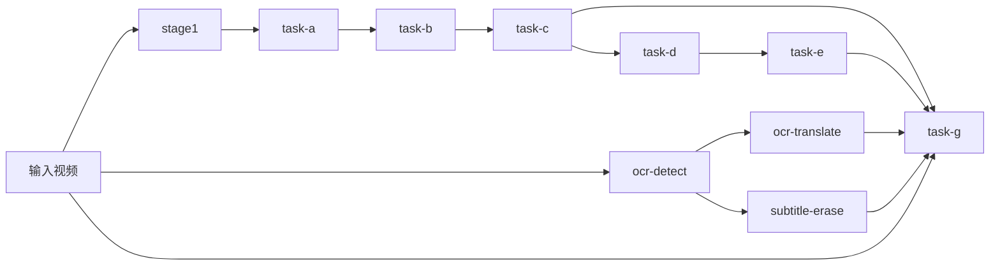

# 模板驱动的受约束 DAG 工作流设计

日期：2026-04-15

## 摘要

将当前线性的 `stage1 -> task-a -> ... -> task-g` pipeline 模型，升级为一个“模板驱动、受约束的 DAG 工作流模型”。

对用户来说，系统仍然保持简单：

- 用户选择一个技术组合模板。
- 模板会展开成一个执行子图。
- 编排器负责解析依赖、按拓扑顺序执行节点、复用缓存产物，并记录节点级状态。

对系统内部来说，模型会更准确：

- 音频配音链仍然是主干，并且坚持由 ASR 驱动。
- OCR 成为一条并行的字幕资产线，而不是 ASR 配音的替代品。
- 硬字幕擦除成为一条独立的、可选的视频净化支线，并且由 OCR 检测结果驱动。
- 交付层只消费已有资产并进行装配，不会偷偷触发缺失的上游步骤。

## 背景

当前仓库已经有比较清晰的职责分层：

- `stage1` 到 `task-e` 构成音频配音主干。
- `task-g` 负责最终交付和视频导出。
- 后端服务和前端已经理解 staged execution、cache reuse、manifest 和 progress tracking 这套机制。

同时，两个相邻仓库提供了对“翻译质量”和“最终交付质量”都很重要的新能力：

- `subtitle-ocr`
  - 从输入视频中检测硬字幕
  - 输出字幕时间轴、文本、几何信息，以及 SRT/JSON
- `video-subtitle-erasure`
  - 从输入视频中擦除原始硬字幕
  - 依赖 OCR 提供的字幕时间轴和几何信息

本轮讨论已经明确了这些需求：

- 配音必须继续由 ASR 驱动。
- 最终展示字幕需要同时支持 ASR 字幕和 OCR 字幕。
- 原始硬字幕擦除是可选能力。
- 整个系统应该建模成“图”，而不是一条固定单线。
- 第一版对外工作流入口应当是模板，而不是任意用户自定义图编辑。
- OCR 需要拆成三个独立节点：
  - `ocr-detect`
  - `ocr-translate`
  - `subtitle-erase`
- 模板需要支持混合执行语义：
  - `required` 节点
  - `optional` 节点

## 目标

- 将工作流建模成一个受约束的 DAG，而不是固定的线性 stage 列表。
- 保留现有音频配音主干及其产物契约。
- 把 OCR 和字幕擦除能力接入为一等工作流节点。
- 对外保持“模板入口”，而不是图编辑器入口。
- 支持“技术组合模板”，并具有稳定、可测试的执行行为。
- 允许交付输出从以下字幕来源中选择：
  - ASR 字幕
  - OCR 字幕
  - 两者都要
  - 两者都不要
- 当开启字幕擦除时，支持可选的 clean-video 交付。
- 让 planning、execution、cache、manifest、logs、progress 继续复用同一套 orchestration 体系。

## 非目标

- v1 不做通用的用户自定义工作流编辑器。
- v1 不通过 UI 暴露任意插件式节点。
- 不使用 OCR 替代 ASR 去做配音或 TTS 文本生成。
- 不把 OCR 执行隐藏进 `task-g`。
- 不允许节点之间通过未声明的进程内对象直接通信。
- 不把整个系统升级成分布式调度平台。

## 核心决策

这份设计明确锁定以下结论：

- 内部模型是“受约束的 DAG”。
- 对外执行入口是“模板注册表”。
- 模板先按“技术组合”命名，后续再加对外友好名称。
- OCR 是一条平行字幕资产线，不替代 ASR 配音主干。
- `subtitle-erase` 严格依赖 `ocr-detect` 结果，不能自己偷偷再跑一遍 OCR。
- OCR 相关能力要成为统一节点系统中的一等节点。
- 模板使用混合执行语义：
  - `required` 节点失败，整个工作流失败
  - `optional` 节点失败，不直接导致主链失败，但最终报告必须标记为部分成功
- `task-g` 继续保持“交付装配器”边界，不隐式触发上游缺失节点。

## 心智模型

系统应该从三层来理解：

1. **能力图**
   - 一个统一的工作流节点图，包含节点注册表和节点依赖关系。
2. **模板**
   - 一个具名的技术组合，从能力图中选择一个子图，并带上一组默认策略。
3. **执行计划**
   - 模板结合请求参数后，展开得到的一个具体、可执行、拓扑有序的计划。

这样做的好处是：外部体验仍然简单，但内部已经从“固定单线”升级成“真实依赖图”。

## 工作流架构



这个图是“受约束”的：

- 它必须无环。
- 节点依赖在代码中静态声明。
- 节点之间只能通过标准产物通信。
- 模板只是从这张能力图中裁切出一个子图。

## 节点分层

节点分为四组。

### 1. 音频主干节点

这些节点仍然是翻译和配音的核心路径：

- `stage1`
- `task-a`
- `task-b`
- `task-c`
- `task-d`
- `task-e`

职责：

- 提取并分离音频
- 进行带说话人归因的转写
- 生成 speaker 资产
- 翻译配音脚本
- 合成目标语言语音
- 做时间轴拟合与最终混音

这条链仍然是任何 dubbing workflow 的默认主干。

### 2. OCR 字幕资产节点

这些节点从屏幕上的硬字幕生成字幕资产：

- `ocr-detect`
- `ocr-translate`

职责：

- 从视频帧中检测字幕事件、时间轴和几何区域
- 把 OCR 文本翻译成最终展示字幕

这些节点是“展示字幕导向”的，不应替代 ASR 配音语义。

### 3. 视频净化节点

- `subtitle-erase`

职责：

- 利用 OCR 时间轴和几何信息擦除原始硬字幕
- 输出供下游交付使用的 clean-video 资产

这个节点只改变视频底板，不改变配音和字幕语义。

### 4. 交付节点

- `task-g`

职责：

- 选择正确的视频底板
- 选择正确的音频资产
- 挂载或导出所需字幕输出
- 产出最终交付文件和交付 manifest

如果某个模板不请求配音音轨，`task-g` 可以直接透传原视频的原始音轨。

`task-g` 是装配器，而不是隐藏的上游调度器。

## 一等节点注册表

现有固定 stage 列表应该升级成统一的工作流节点注册表。

每个节点定义都应声明：

- `node_name`
- `group`
- `dependencies`
- `default_required`
- `artifact_contract`
- `cache_inputs`
- `runner_kind`
- `log_name`
- `manifest_name`

### 注册表应满足的行为

- 依赖解析基于图，而不是基于列表切片。
- 每个节点有稳定 ID 和稳定产物契约。
- 每个节点都可以在状态视图和日志里展示。
- planner 能为任意模板计算完整传递依赖闭包。
- 现有节点和 OCR 节点使用同一套 orchestration primitive。

## 初始节点集合与依赖关系

初始图建议如下：

- `stage1`
  - 依赖：`input-video`
- `task-a`
  - 依赖：`stage1`
- `task-b`
  - 依赖：`stage1`、`task-a`
- `task-c`
  - 依赖：`task-a`、`task-b`
- `task-d`
  - 依赖：`task-c`、`task-b`
- `task-e`
  - 依赖：`stage1`、`task-a`、`task-c`、`task-d`
- `ocr-detect`
  - 依赖：`input-video`
- `ocr-translate`
  - 依赖：`ocr-detect`
- `subtitle-erase`
  - 依赖：`input-video`、`ocr-detect`
- `task-g`
  - 依赖：
    - `input-video`
    - 根据交付策略解析出来的交付资产：
      - 当请求配音音轨时，依赖 `task-e`
      - 当请求 ASR 字幕导出时，依赖 `task-c`
      - 当请求 OCR 字幕导出时，依赖 `ocr-translate`
      - 当请求 clean-video 交付时，依赖 `subtitle-erase`

重要说明：

- ASR 来源的展示字幕，主要来自现有音频主干里的 `task-c` 产物。
- OCR 来源的展示字幕，来自 `ocr-translate`。
- 这两类字幕都属于合法的交付字幕来源。

## 产物契约

节点边界必须是“产物边界”。任何下游节点都不应依赖上游实现细节。

### 音频主干资产

当前已有的音频链产物契约继续保留并视为权威。

示例：

- `stage1`
  - `voice.*`
  - `background.*`
  - `manifest.json`
- `task-a`
  - `segments.<lang>.json`
  - `segments.<lang>.srt`
  - `task-a-manifest.json`
- `task-c`
  - `translation.<target>.json`
  - `translation.<target>.editable.json`
  - `translation.<target>.srt`
  - `task-c-manifest.json`
- `task-e`
  - `dub_voice.<target>.wav`
  - `preview_mix.<target>.wav`
  - `timeline.<target>.json`
  - `task-e-manifest.json`

### 新增 OCR 资产

#### `ocr-detect`

推荐 bundle：

- `ocr-detect/`
  - `ocr_events.json`
  - `ocr_events.srt`
  - `ocr_regions.json`
  - `ocr-detect-manifest.json`
  - `debug/` 可选

`ocr_events.json` 应作为标准下游输入。

它至少应包含：

- `event_id`
- `start`
- `end`
- `text`
- `confidence`
- `language`
- `geometry`
  - `box`
  - `polygon`
  - `rotated_box`（若可用）
- `source`
  - `engine`
  - `sample_interval`
  - `position_mode`

这里最关键的是“事件级结构化数据”，而不是原始逐帧 dump。

#### `ocr-translate`

推荐 bundle：

- `ocr-translate/`
  - `ocr_subtitles.<target>.json`
  - `ocr_subtitles.<target>.srt`
  - `ocr-translate-manifest.json`

这个节点消费 `ocr_events.json`，产出供展示/导出的翻译字幕资产。

#### `subtitle-erase`

推荐 bundle：

- `subtitle-erase/`
  - `clean_video.<target-container>`
  - `erase_report.json`
  - `subtitle-erase-manifest.json`
  - `debug/` 可选

这个节点消费输入视频和 `ocr_events.json`，输出 clean-video 底板。

### 交付资产

`task-g` 仍然负责产出最终交付 bundle，但现在要明确视频来源和字幕来源。

推荐输出：

- `final_preview.<target>.mp4`
- `final_dub.<target>.mp4`
- `delivery-manifest.json`
- `delivery-report.json`
- 当需要导出 sidecar 字幕时：
  - `final_preview.<target>.asr.srt`
  - `final_preview.<target>.ocr.srt`
  - `final_dub.<target>.asr.srt`
  - `final_dub.<target>.ocr.srt`

第一版建议优先以 sidecar 字幕为主，而不是一下子生成大量 burn-in 变体 mp4。

## 模板模型

模板是对外暴露的工作流抽象。

每个模板定义应声明：

- `template_id`
- `description`
- `entry_nodes`
- `required_nodes`
- `optional_nodes`
- `default_delivery_policy`
- `default_parameter_preset`
- `expected_artifacts`

### 模板展开规则

当用户选择一个模板时：

1. 取出模板声明的节点集合。
2. 使用节点注册表计算其传递依赖闭包。
3. 根据模板给节点标记 required / optional。
4. 应用模板默认参数预设。
5. 生成最终的可执行计划。

也就是说：模板表达“意图”，planner 负责把它解成具体节点级执行计划。

## 初始模板目录

第一版模板数量应当刻意保持很小。

### 1. `asr-dub-basic`

用途：

- 基础配音流程

节点：

- required：
  - `stage1`
  - `task-a`
  - `task-b`
  - `task-c`
  - `task-d`
  - `task-e`
  - `task-g`

默认交付策略：

- 音频：`preview_mix` 和 `dub_voice`
- 字幕来源：`asr`
- clean video：关闭

### 2. `asr-dub+ocr-subs`

用途：

- 配音 + OCR 展示字幕

节点：

- required：
  - `stage1`
  - `task-a`
  - `task-b`
  - `task-c`
  - `task-d`
  - `task-e`
  - `ocr-detect`
  - `ocr-translate`
  - `task-g`

默认交付策略：

- 字幕来源：`both`
- clean video：关闭

### 3. `asr-dub+ocr-subs+erase`

用途：

- 配音 + OCR 字幕 + clean-video 交付

节点：

- required：
  - `stage1`
  - `task-a`
  - `task-b`
  - `task-c`
  - `task-d`
  - `task-e`
  - `ocr-detect`
  - `task-g`
- optional：
  - `ocr-translate`
  - `subtitle-erase`

默认交付策略：

- 字幕来源：`asr` 或 `both`，取决于 `ocr-translate` 是否成功
- clean video：`clean_if_available`

这是第一类真正体现“部分成功”语义价值的模板。

### 4. `ocr-subs+erase-only`

用途：

- 不做配音，只做字幕和视频净化

节点：

- required：
  - `ocr-detect`
  - `task-g`
- optional：
  - `ocr-translate`
  - `subtitle-erase`

默认交付策略：

- 音频来源：`original`
- 视频底板：`original` 或 `clean_if_available`
- 字幕输出：优先 `ocr`

这个模板是有价值的，但如果第一版范围需要收紧，可以稍后实现。

## Required / Optional 执行语义

模板使用混合执行语义。

### Required 节点

- required 节点失败，工作流失败。
- 所有依赖它的下游节点都不再执行。
- workflow report 状态变为 `failed`。

### Optional 节点

- optional 节点失败，不会直接导致主链失败，只要不存在某个 required 下游唯一依赖它。
- 当 required 主链成功，但一个或多个 optional 节点失败时，workflow report 应标记为 `partial_success`。
- 交付层可以依据 fallback policy 继续完成交付。

### 示例

对于 `asr-dub+ocr-subs+erase`：

- 如果 `ocr-detect` 失败，则整个工作流失败，因为 `subtitle-erase` 和 `ocr-translate` 都无法正确解析，而且该模板显式要求 OCR detection。
- 如果 `ocr-translate` 失败，但 `subtitle-erase` 和音频主干成功，则仍可以只用 ASR 字幕完成交付。
- 如果 `subtitle-erase` 失败，但音频主干和字幕资产成功，则仍可以退回原视频底板完成交付。

## 交付策略

`task-g` 应接受显式交付策略，而不是依赖隐式内部 heuristics。

推荐策略字段：

- `video_source`
  - `original`
  - `clean`
  - `clean_if_available`
- `audio_source`
  - `preview_mix`
  - `dub_voice`
  - `both`
  - `original`
- `subtitle_source`
  - `none`
  - `asr`
  - `ocr`
  - `both`
- `subtitle_render_mode`
  - `sidecar`
  - `burn_in`
  - `both`
- `export_preview`
  - `true/false`
- `export_dub`
  - `true/false`

### 交付边界规则

`task-g` 不能自动去跑缺失的上游节点。

如果交付策略要求 `ocr` 字幕，但 `ocr-translate` 没有出现在执行计划中，或者没有成功，`task-g` 必须：

- 只有在模板把这条路径标记为 optional，且交付策略允许 fallback 时，才能降级
- 否则必须清晰报错，说明缺失必要资产

这能维持干净的 planner/executor 边界。

## 规划与执行流程

工作流引擎应遵循以下流程：

1. 加载选中的模板。
2. 根据节点依赖闭包展开成完整节点集合。
3. 解析 required / optional 语义。
4. 将请求覆盖项和模板默认项合并。
5. 构建拓扑有序的执行计划。
6. 对每个节点：
   - 解析 cache eligibility
   - 如缓存有效则复用
   - 如需要则执行节点 runner
   - 写出节点 manifest、log 和状态
7. 基于显式资产引用和交付策略执行交付。
8. 写出 workflow manifest、report 和 status snapshot。

## 缓存与复用规则

现有 cache-aware 行为需要从“stage 粒度”扩展到“node 粒度”。

每个节点应根据以下内容定义 cache key：

- 上游产物身份
- 相关请求参数
- 实现版本或 backend 签名

关键预期：

- `subtitle-erase` 在输入视频、OCR 事件和擦除参数不变时应可复用。
- `ocr-translate` 在 OCR 事件、目标语言和翻译 backend 配置不变时应可复用。
- `task-g` 在选择的资产和交付策略不变时应可复用。

缓存校验方式继续保持 manifest-based。

## 状态、日志与报告

当前的 stage-oriented reporting 需要升级成 node-oriented。

推荐顶层产物：

- `workflow-request.json`
- `workflow-manifest.json`
- `workflow-report.json`
- `workflow-status.json`
- `logs/<node-name>.log`

兼容性说明：

- 在迁移期，可以保留 legacy 的 `pipeline-*` 文件名。
- 但在内部模型上，应该已经从固定 stage 转向通用 workflow node。

### 状态模型

节点状态支持：

- `pending`
- `running`
- `succeeded`
- `cached`
- `failed`
- `skipped`

工作流状态支持：

- `running`
- `succeeded`
- `partial_success`
- `failed`

一旦引入 optional 节点，这个扩展就是必要的。

## 目录布局

第一轮迁移可以保留现有音频 bundle 路径，并在旁边增加新的节点目录。

推荐结构：

```text
<output-root>/
  stage1/
  task-a/
  task-b/
  task-c/
  task-d/
  task-e/
  ocr-detect/
  ocr-translate/
  subtitle-erase/
  task-g/
    delivery/
  logs/
  workflow-request.json
  workflow-manifest.json
  workflow-report.json
  workflow-status.json
```

如果迁移期需要兼容，`pipeline-request.json`、`pipeline-manifest.json`、`pipeline-report.json` 和 `pipeline-status.json` 可以作为别名或过渡输出保留。

## Server 与 Frontend 影响

后端和前端都需要从“固定 stage 列表”升级成“节点感知模型”。

### Backend

把这类固定写死的假设：

- `PIPELINE_STAGES = ["stage1", ... "task-g"]`

替换成：

- node registry 查询
- template metadata
- 按 node group 展示的 helper

### Frontend

第一版 UI 不需要图编辑器。

它只需要支持：

- 选择模板
- 调整受支持的 policy override
- 展示 resolved node plan
- 以 lane 形式展示节点进度：
  - 音频主干
  - OCR 字幕线
  - 视频净化线
  - 交付线

这样 UI 仍然清楚，不会过早暴露任意图编辑能力。

## 工作流可视化与动画展示

工作流可视化不是单纯的视觉装饰，它本身就是工作流契约的一部分，因为它会约束：

- 后端必须返回什么图数据
- 节点状态如何表达
- 模板如何向用户解释
- 运行中任务如何被实时监控

### 默认展示目标

UI 默认展示的图，应该是“当前模板展开后的执行子图”，或者“当前运行任务的执行子图”。

不要默认展示完整能力图。

完整能力图可以通过显式切换查看，但主界面首先应回答的是：

- 这个模板实际会跑什么
- 当前正在跑什么
- 哪些节点已经完成、失败，或者命中缓存

### 图布局

布局应采用“固定的分层 DAG 布局”，不要使用 force-directed graph。

图应按 lane 分组展示：

- 音频主干
- OCR 字幕线
- 视频净化线
- 交付线

这样做的好处：

- 多次运行之间的心智模型稳定
- 不同模板之间更容易比较
- 动画过程中视觉噪音更少
- 更容易做移动端和低动效降级

### 运行中可视化

当任务运行时，这张执行子图应持续可见。

任务详情页不应该在运行时把图隐藏掉，只保留一个纯文本状态列表。图应作为主要的实时监控界面，文本详情作为辅助的钻取面板。

图上至少要表达这些节点状态：

- `pending`
- `running`
- `cached`
- `succeeded`
- `failed`
- `skipped`

同时，工作流整体状态里的 `partial_success` 也必须有独立视觉语义，不能和普通成功混在一起。

### 动画语义

动画的职责是表达执行状态，而不是单纯为了“看起来炫”。

推荐动效语义：

- 初始加载
  - 节点和边做一个短的、分阶段 reveal
- 运行中节点
  - 当前节点获得主高亮
  - 当前活跃边有方向性流动感
- `cached` 节点
  - 必须明显区别于 `pending`
  - 动效和强调程度低于真正运行中的节点
- 成功节点
  - 用轻量的完成确认动效
- 失败节点
  - 动画应干净地停住
  - 失败节点应成为最容易被看见的视觉焦点

目标是“让执行过程一眼可懂”，不是“尽量堆动效”。

### 可钻取交互

这张图应当支持钻取。

第一版不一定需要完整独立的工作流 inspector 页面，但点击任意节点时，应打开一个紧凑的详情面板，至少展示：

- 节点名称和分组
- 它是 required 还是 optional
- 当前状态
- 当前进度百分比（若可用）
- 简短执行摘要
- 输入产物引用
- 输出产物引用
- manifest 链接
- log 链接
- 如果失败，给出错误摘要

相比只读图，这种可钻取图更适合作为任务运行时的主理解入口。

### 后端图数据契约

后端应显式返回“可视化专用图数据”，而不是让前端自己从 manifest 里猜图结构。

推荐 payload 结构：

- `workflow`
  - `template_id`
  - `status`
  - `selected_policy`
- `nodes`
  - `id`
  - `label`
  - `group`
  - `required`
  - `status`
  - `progress_percent`
  - `summary`
  - `manifest_path`
  - `log_path`
- `edges`
  - `from`
  - `to`
  - `state`
    - `inactive`
    - `active`
    - `completed`
    - `blocked`

这份契约应同时支持：

- 运行前的模板预览图
- 运行中的执行图

### 性能与可访问性

这套可视化必须支持优雅降级。

要求：

- 尊重 `prefers-reduced-motion`
- 在性能受限设备上支持低动效渲染
- 在小屏设备上支持简化静态图或节点列表回退
- 避免持续变化的物理模拟布局

第一版建议优先用 SVG 或其它确定性渲染方案，而不是视觉噪音较强的力导布局。

## 相邻仓库的集成策略

第一版实现可以先桥接相邻仓库，而不是马上把实现完全复制进当前仓库。

推荐接入方式：

- `ocr-detect` runner
  - 通过稳定 CLI 或服务 wrapper 调用 `subtitle-ocr`
- `subtitle-erase` runner
  - 通过稳定 CLI 或服务 wrapper 调用 `video-subtitle-erasure`

wrapper 的要求：

- 输出目录布局确定
- manifest 写法统一
- exit code 处理统一
- workflow request 到 sibling project CLI 的参数映射稳定

这样边界更清楚，也为后续是否合并仓库保留空间。

## 错误处理

工作流必须产出明确、可分类的失败。

关键失败类型包括：

- template resolution failure
- dependency resolution failure
- missing required asset
- node execution failure
- cache manifest mismatch
- delivery policy conflict

行为要求：

- 依赖闭包必须在执行前就算清楚
- 不可能成立的计划应该在 planning 阶段就失败，而不是等到交付阶段才崩
- optional 节点失败必须在报告中被明确表示
- 交付 fallback 必须是 policy-driven 且可见的

## 测试策略

测试重点应放在模板展开、节点契约和 partial-success 语义上。

### 1. Planner Tests

- 每个模板的依赖闭包是否正确
- 拓扑顺序是否正确
- required / optional 标注是否正确
- 非法模板策略是否被拒绝

### 2. Node Contract Tests

- OCR detect bundle contract
- OCR translate bundle contract
- subtitle erase bundle contract
- 交付层对 `asr`、`ocr`、`both`、`none` 的资产解析是否正确

### 3. Orchestrator Tests

- 节点级 cache hit 是否生效
- required 节点失败时是否立即终止工作流
- optional 节点失败时是否正确得到 `partial_success`
- `task-g` 是否拒绝自动运行缺失的上游工作

### 4. Integration Tests

每个支持的模板至少要有一个 smoke test：

- `asr-dub-basic`
- `asr-dub+ocr-subs`
- `asr-dub+ocr-subs+erase`

每个 smoke test 都应验证：

- resolved node plan
- expected artifacts
- workflow status
- node-level manifest 和 log 是否生成

### 5. Manual Validation

第一版实现仍然需要人工验证：

- 同一视频上 ASR 字幕与 OCR 字幕的质量差异
- 开启/关闭字幕擦除时 clean-video 的主观效果
- optional 节点失败时的交付 fallback 行为

## 迁移计划

迁移应当分阶段进行。

### Phase 1: 内部图模型

- 引入 node registry 和 dependency resolver
- 把现有 A-E 和 G 都先注册成节点
- 保留一个“等价于当前线性 pipeline”的默认模板

### Phase 2: OCR 节点接入

- 新增 `ocr-detect`
- 新增 `ocr-translate`
- 新增 `subtitle-erase`
- 通过 wrapper runner 桥接相邻仓库

### Phase 3: 模板入口

- 新增模板注册表
- 在 CLI、后端和前端加入模板选择
- 保留一个默认模板保证向后兼容

### Phase 4: 报告与 UI 适配

- 把状态展示从固定 stage 升级成 node-aware grouped lanes
- 增加 `partial_success` 语义支持
- 增加交付策略可见性

### Phase 5: 兼容清理

- 决定是否把 `pipeline-*` 正式改名为 `workflow-*`
- 移除 server 和 frontend 内部对固定 stage 的依赖假设

## 推荐的第一实现切片

不要一次把整个图工作流生态都做完。

第一刀建议是：

1. 保持现有音频主干不变，但把它们注册成节点。
2. 在底层加入 registry-based planning。
3. 先接入 `ocr-detect` 作为第一个新节点。
4. 先新增一个带 OCR 的模板：
   - `asr-dub+ocr-subs`
5. `task-g` 先以 sidecar 字幕为主，不优先做 burn-in 大爆炸。

这个切片已经足以建立真正的图基础，同时不会把字幕擦除、UI 复杂度和所有模板变体一次性都塞进第一版。

## 已确认结论

本 spec 默认这些点已经在讨论中确认：

- 工作流是图，而不是单线
- 这个图必须是受约束、无环的
- 对外抽象是模板
- 模板先按技术组合命名
- OCR 拆为三个节点
- 接受 `required` 与 `optional` 混合语义
- OCR 相关节点纳入统一节点系统
- 交付层保持纯装配边界

## 最终建议

采用“模板驱动的受约束 DAG 架构”。

落到工程上就是：

- 保留现有配音主干作为稳定核心
- 把 OCR 和字幕擦除接成一等并行节点
- 对外暴露技术组合模板，而不是任意图编辑
- 由 planner 构建节点级执行子图
- 由 orchestrator 按节点执行并复用缓存和 manifest
- 保持交付显式、策略化，不做隐藏上游执行

这是在当前需求下，既足够正确、又不过度设计的最小架构方案。
