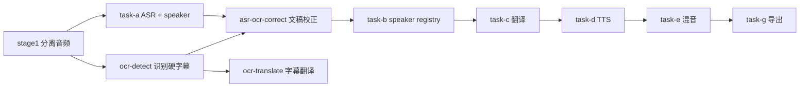

# OCR 辅助 ASR 配音文稿校正设计

## 1. 背景

当前配音流水线以 ASR 结果作为中文源文稿，再进入翻译、TTS 和混音阶段。对于带硬中文字幕的视频，ASR 经常出现音近错字、专名识别错误、漏字或多识别问题，例如：

| ASR 文本 | OCR 文本 |
| --- | --- |
| 虽扛下了天洁 | 虽扛下了天劫 |
| 头发龙祖 | 讨伐龙族 |
| 陈堂官全军戒备 | 陈塘关全军戒备 |
| 以防深孤暴和东海龙祖来犯 | 以防申公豹和东海龙族来犯 |
| 你是杨 我是摩 | 你是妖 / 我是魔 |
| 小燕拭摩 | 小爷是魔 |

这些错误会继续污染 Task C 翻译、Task D 配音和最终导出。硬字幕 OCR 在这类素材中通常比 ASR 更接近正式台词，因此需要在配音链路里引入 OCR 辅助校正。

## 2. 目标

生成一份更适合配音和翻译的中文文稿：

```text
ASR 时间轴 + ASR speaker_label + OCR 校正后的中文台词
```

具体目标：

- 保留 ASR 的 `start`、`end`、`duration` 和 `speaker_label`
- 用 OCR 硬字幕文本修正 ASR 的 `text`
- 后续 Task B、Task C、Task D、Task E 默认使用校正后的中文文稿
- 所有校正动作可追溯、可审计、可回退
- 默认开启“标准”校正强度，用户可在 UI 中调整
- 将台词校正抽象为独立原子能力，既可被流水线节点复用，也可单独调用

## 3. 非目标

- 不默认修改 ASR 时间轴
- 不默认修改 ASR speaker 归因
- 不默认插入 OCR 有但 ASR 没有的配音段
- 不覆盖原始 ASR 输出
- 不改变现有 `transcription` 原子能力的默认语义；它仍然只代表原始 ASR
- 不让 LLM 全量重写台词
- 不在 V1 中解决所有复杂字幕场景，如字幕与台词不一致、弹幕、多语言混排、画面文字误识别等

## 4. 核心决策

### 4.1 算法优先，LLM 兜底

V1 默认采用确定性算法完成校正，不默认调用 LLM。

理由：

- ASR 和 OCR 都有时间戳，时间对齐是强证据
- 硬字幕通常是正式台词，OCR 高置信结果可直接作为替换依据
- 算法结果可预测、成本低、易测试
- LLM 可能脑补剧情、润色句式或改变台词长度

LLM 仅作为 V2 能力或高级选项，用于算法标记为 `review` 的少量不确定段。

### 4.2 默认开启“标准”校正强度

创建任务或任务配置中，台词校正默认开启，并默认选择 `standard`。

默认策略：

```text
高置信 OCR 自动修正 ASR 文本
不确定段保留 ASR 并标记 review
OCR-only 只报告，不插入配音段
```

### 4.3 OCR-only 默认只报告

对于 OCR 有字幕但 ASR 没有对应 segment 的情况，V1 默认不插入新配音段，只在 report 中记录漏识别。

例子：

```text
OCR: 那又如何
ASR: 无对应 segment
```

处理结果：

```text
不改变配音文稿
report 中记录 ocr_only_event
needs_review = true
```

理由：

- 没有 ASR segment 就没有可靠的 speaker、起止时间和后续 TTS 时长预算
- 自动插入可能破坏配音时间线
- 先报告问题，后续可通过人工编辑或 V2 策略处理

### 4.4 不新增全局“是否适合校正”的自动判定

V1 不增加额外的全局前置判定，例如 `hard_subtitle_dialogue_confidence`。

原因：

- 先避免扩大实现复杂度
- 用户可以通过 UI 手动关闭台词校正
- 校正算法本身仍会对单段做置信度、长度和冲突判断

### 4.5 统一有效文稿路径

下游节点不得各自拼接校正文稿路径。必须提供一个统一解析函数，例如：

```python
effective_task_a_segments_path(request)
```

该函数负责选择：

```text
优先 asr-ocr-correct/voice/segments.zh.corrected.json
否则 task-a/voice/segments.zh.json
```

Task B、Task C、Task E 等所有需要中文 segment 的节点都必须通过这个函数取路径。

### 4.6 记录算法版本和质量指标

校正产物必须记录算法版本：

```json
{
  "algorithm_version": "ocr-guided-asr-correction-v1"
}
```

这样后续调整阈值、加入拼音相似度或 LLM 仲裁时，可以明确让旧缓存失效。

校正 report 还需要记录质量指标，用于排错、UI 展示和后续优化。

### 4.7 与 glossary 的关系

OCR 校正和翻译 glossary 是两层不同能力：

```text
OCR 校正：先修正中文源文稿
glossary：再保护或规范翻译术语
```

执行顺序应为：

```text
ASR -> OCR 校正中文 -> glossary 预处理 -> 翻译
```

OCR 中抽取到的专名可以作为未来术语建议，但 V1 不把 OCR 专名自动写入 glossary，也不绕过现有 glossary 逻辑。

### 4.8 原子能力边界

台词校正需要进入原子能力层，但不应直接塞进现有 `transcription` 原子工具。

边界如下：

```text
transcription
只负责 ASR，输出原始 segments 和 srt。

ocr-detect
只负责画面字幕 OCR，输出 OCR events / OCR subtitles。

transcript-correction
负责读取 ASR segments 和 OCR events，输出 corrected segments、corrected srt 和 correction report。
```

`asr-ocr-correct` 流水线节点和 `transcript-correction` 原子能力应复用同一个底层校正模块，例如 `src/translip/transcription/ocr_correction.py`。

这样做的理由：

- 保留一份干净的 ASR 原始产物，方便排错和对比
- 允许用户只重跑台词校正，而不必重跑 ASR
- 原子能力可单独用于调试、评估、批量校正或后续人工编辑入口
- 避免 `transcription` 在有 OCR 和无 OCR 时输出语义不一致

## 5. 流水线变更

当前 OCR 模板流水线大致是：

```text
stage1 -> task-a -> task-b -> task-c -> task-d -> task-e -> task-g
ocr-detect -> ocr-translate
```

建议新增节点：

```text
asr-ocr-correct
```

新流水线：



### 5.1 下游输入路径

新增一个“有效 ASR 文稿”解析逻辑：

```text
如果 segments.zh.corrected.json 存在且校正节点成功：
  下游使用校正文稿
否则：
  下游回退原始 ASR 文稿
```

受影响节点：

- `task-b`: speaker registry 仍用 ASR 时间轴和 speaker label，但文本来自校正文稿
- `task-c`: 翻译源文稿使用校正文稿
- `task-d`: TTS 使用校正后翻译
- `task-e`: 时间线仍来自 ASR segment 时间

实现要求：

- 在 orchestration command/path 层集中提供 `effective_task_a_segments_path`
- `build_task_b_command`
- `build_task_c_command`
- `build_task_e_command`

都必须读取同一个有效文稿路径，避免不同节点使用不同文本版本。

### 5.2 模板影响

建议只在包含 OCR 检测能力的模板中启用校正节点：

- `asr-dub+ocr-subs`
- `asr-dub+ocr-subs+erase`

对于 `asr-dub-basic`：

- 没有 OCR 输入
- 校正节点不运行
- UI 可展示“需要 OCR 字幕链路才可启用”

### 5.3 低耦合节点编排

节点依赖应通过 `NODE_REGISTRY` 和模板计划表达，而不是在 runner 中写死执行顺序。

目标依赖关系：

```text
task-a + ocr-detect -> asr-ocr-correct -> task-b -> task-c -> task-d -> task-e
```

这意味着：

- `task-b` 不应再直接依赖 `task-a`，而应依赖 `asr-ocr-correct`
- `task-c` 仍依赖 `task-b`
- OCR 模板中的 `asr-ocr-correct` 是 required node
- 非 OCR 模板不包含 `asr-ocr-correct`

这样后续如果增加人工校对、LLM 仲裁或其他校正文稿来源，只需替换有效文稿解析和节点依赖，不需要重写整个 runner。

### 5.4 原子能力设计

新增原子能力：

```text
tool_id: transcript-correction
name_zh: 台词校正
name_en: Transcript Correction
category: speech
icon: ScanText
max_files: 2
accept_formats: .json
```

V1 推荐先以 JSON 为主输入，SRT 解析可以作为后续增强。请求参数：

```json
{
  "segments_file_id": "asr-segments-json-file-id",
  "ocr_events_file_id": "ocr-events-json-file-id",
  "enabled": true,
  "preset": "standard",
  "ocr_only_policy": "report_only"
}
```

输出结果：

```json
{
  "status": "succeeded",
  "segment_count": 26,
  "corrected_count": 18,
  "kept_asr_count": 5,
  "review_count": 2,
  "ocr_only_count": 1,
  "algorithm_version": "ocr-guided-asr-correction-v1",
  "corrected_segments_file": "segments.zh.corrected.json",
  "corrected_srt_file": "segments.zh.corrected.srt",
  "report_file": "correction-report.json",
  "manifest_file": "correction-manifest.json"
}
```

原子能力实现要求：

- 不调用 ASR，不调用 OCR，只消费二者已有产物
- 不修改输入文件
- 默认 `preset = standard`
- 默认 `ocr_only_policy = report_only`
- 输出 payload 与流水线 corrected segments 完全一致
- 报告里必须包含 `algorithm_version` 和质量指标
- 现有 `transcription` 原子能力不增加默认 OCR 校正行为

## 6. 产物设计

新增目录：

```text
asr-ocr-correct/voice/
  segments.zh.corrected.json
  segments.zh.corrected.srt
  correction-report.json
  correction-manifest.json
```

### 6.1 `segments.zh.corrected.json`

采用当前 pipeline 的 segments payload 结构作为新的节点契约。这里不是为了兼容存量历史数据，而是为了让后续 Task B、Task C、Task E 能用同一种 segment 结构读取有效文稿。

只修改：

```text
segments[].text
```

保留：

```text
segments[].id
segments[].start
segments[].end
segments[].duration
segments[].speaker_label
segments[].language
```

建议在顶层增加校正元数据：

```json
{
  "correction": {
    "enabled": true,
    "algorithm_version": "ocr-guided-asr-correction-v1",
    "source": "ocr",
    "report_path": "asr-ocr-correct/voice/correction-report.json",
    "corrected_count": 18,
    "review_count": 2,
    "ocr_only_count": 1
  }
}
```

### 6.2 `correction-report.json`

记录每段的校正证据和决策。

示例：

```json
{
  "summary": {
    "segment_count": 26,
    "corrected_count": 18,
    "kept_asr_count": 5,
    "review_count": 2,
    "ocr_only_count": 1,
    "auto_correction_rate": 0.692,
    "review_rate": 0.077,
    "fallback_reason": null,
    "algorithm_version": "ocr-guided-asr-correction-v1"
  },
  "segments": [
    {
      "segment_id": "seg-0001",
      "start": 0.21,
      "end": 2.81,
      "speaker_label": "SPEAKER_00",
      "original_asr_text": "虽扛下了天洁",
      "corrected_text": "虽扛下了天劫",
      "decision": "use_ocr",
      "ocr_event_ids": ["evt-0001"],
      "alignment_score": 0.91,
      "ocr_quality_score": 0.99,
      "text_similarity_score": 0.83,
      "needs_review": false
    }
  ],
  "ocr_only_events": [
    {
      "event_id": "evt-0035",
      "start": 93.249,
      "end": 93.999,
      "text": "那又如何",
      "decision": "ocr_only",
      "action": "reported_only",
      "needs_review": true
    }
  ]
}
```

### 6.3 `correction-manifest.json`

记录运行配置、输入输出和状态。

```json
{
  "status": "succeeded",
  "input": {
    "asr_segments_path": "task-a/voice/segments.zh.json",
    "ocr_events_path": "ocr-detect/ocr_events.json"
  },
  "artifacts": {
    "corrected_segments": "asr-ocr-correct/voice/segments.zh.corrected.json",
    "corrected_srt": "asr-ocr-correct/voice/segments.zh.corrected.srt",
    "report": "asr-ocr-correct/voice/correction-report.json"
  },
  "config": {
    "algorithm_version": "ocr-guided-asr-correction-v1",
    "enabled": true,
    "preset": "standard",
    "ocr_only_policy": "report_only"
  }
}
```

## 7. 算法设计

算法分为五层：

```text
OCR 预处理
ASR-OCR 候选召回
单调区间对齐
文本与置信度评分
校正决策
```

### 7.1 OCR 预处理

对每条 OCR event 做清洗、归一化和质量评分。

清洗：

- 去除首尾空白
- 规范全角半角标点
- 去除重复空格
- 修正异常毫秒值
- 合并明显重复的连续 OCR event

过滤或降权：

- OCR confidence 过低
- 文本为空或全是标点
- 中文字符占比过低
- bbox 不在稳定字幕区域
- 持续时间异常
- 疑似水印、标题、UI 文案
- 与前后字幕位置明显不同

质量分：

```text
ocr_quality_score =
  confidence_score
  + region_stability_score
  + duration_sanity_score
  + chinese_ratio_score
  - non_dialogue_penalty
```

### 7.2 字幕区域稳定性

硬字幕通常出现在固定区域。可以根据 OCR events 的 bbox 聚类，推断主字幕区域。

规则：

- 统计所有高置信 OCR bbox 的中心点和高度
- 找到出现频率最高的字幕区域
- 位于主区域内的 OCR event 加分
- 明显偏离主区域的 OCR event 降权或标记 review

V1 可以只做简单版本：

```text
如果大多数 OCR 都在底部区域，则优先信任底部 OCR
偏离底部区域的 OCR 不参与自动替换
```

### 7.3 ASR-OCR 候选召回

对每个 ASR segment 查找 OCR 候选。

默认参数：

```json
{
  "lead_tolerance_sec": 0.6,
  "lag_tolerance_sec": 0.8,
  "min_overlap_sec": 0.15
}
```

候选条件：

```text
OCR 与 ASR 有真实时间重叠
或 OCR 中点落在 ASR 段内
或 OCR 在容忍窗口内，且文本相似度足够高
```

注意：

- 容忍窗口只是候选召回，不代表一定替换
- OCR-only 不能因为“距离近”就自动追加到最近 ASR 段
- 如果 OCR 与 ASR 无重叠且文本不相似，应进入 `ocr_only_events`

### 7.4 单调区间对齐

ASR 和 OCR 都按时间排序。自动校正时应满足：

- 每个 ASR segment 最多匹配一组连续 OCR events
- 每条 OCR event 最多被一个 ASR segment 自动使用
- OCR 匹配顺序不能倒退

支持结构：

| 结构 | 处理 |
| --- | --- |
| 一条 ASR 对一条 OCR | 高置信时直接 `use_ocr` |
| 一条 ASR 对多条 OCR | 按时间顺序拼接，决策为 `merge_ocr` |
| 多条 ASR 争抢一条 OCR | 不强拆，标记 `review` |
| ASR 有、OCR 无 | 保留 ASR |
| OCR 有、ASR 无 | `ocr_only`，只报告 |

### 7.5 文本评分

对 ASR 文本和 OCR 合并文本计算多维评分。

```text
replacement_score =
  0.35 * alignment_score
  + 0.25 * ocr_quality_score
  + 0.15 * text_similarity_score
  + 0.15 * pinyin_similarity_score
  + 0.10 * length_sanity_score
  - neighbor_conflict_penalty
```

其中：

- `alignment_score`: 时间对齐强度
- `ocr_quality_score`: OCR 质量
- `text_similarity_score`: 去标点后的字符相似度
- `pinyin_similarity_score`: 中文拼音或近音相似度
- `length_sanity_score`: OCR 和 ASR 长度比例是否合理
- `neighbor_conflict_penalty`: 是否与相邻 ASR 争抢同一 OCR

V1 可先实现：

- 时间对齐
- OCR 质量
- 字符相似度
- 长度合理性

V1.1 再加入拼音相似度。

### 7.6 长度合理性

计算：

```text
length_ratio = len(clean_ocr_text) / len(clean_asr_text)
```

默认阈值：

```json
{
  "min_length_ratio": 0.45,
  "max_length_ratio": 2.2
}
```

如果 OCR 明显更短，可能是 OCR 漏字；如果 OCR 明显更长，可能是 OCR 多识别画面文字或跨段合并。

这些情况应优先 `review`，不要自动替换。

## 8. 校正决策

每个 ASR segment 输出以下决策之一：

| 决策 | 含义 | 输出文本 |
| --- | --- | --- |
| `use_asr` | 保留 ASR | 原 ASR 文本 |
| `use_ocr` | 使用单条 OCR | OCR 文本 |
| `merge_ocr` | 合并多条 OCR | 按时间拼接的 OCR 文本 |
| `review` | 不确定 | 默认保留 ASR |
| `ocr_only` | OCR 有但 ASR 无 | 不进入 corrected segments，只进入 report |

### 8.1 自动使用 OCR

满足以下条件时自动替换：

```text
ocr_quality_score >= 0.85
alignment_score >= 0.55
length_ratio between 0.45 and 2.20
no_neighbor_conflict = true
```

### 8.2 自动合并多条 OCR

满足以下条件时自动合并：

```text
候选 OCR events 都落在同一个 ASR segment 的时间范围或合理容忍窗口内
OCR events 顺序稳定
合并后长度合理
没有和相邻 ASR 争抢
```

### 8.3 保留 ASR

以下情况保留 ASR：

```text
无 OCR 候选
OCR 质量低
时间对齐弱
OCR 疑似非台词
OCR 合并文本明显残缺
```

### 8.4 标记 review

以下情况标记 review：

```text
多个 ASR 段争抢同一 OCR
OCR 和 ASR 长度差异过大
OCR 质量中等但文本差异大
OCR 时间接近但不重叠
OCR-only
```

## 9. 典型场景处理

### 9.1 ASR 音近错字

```text
ASR: 虽扛下了天洁
OCR: 虽扛下了天劫
```

处理：

```text
decision = use_ocr
```

### 9.2 ASR 整句错识别

```text
ASR: 头发龙祖
OCR: 讨伐龙族
```

处理：

```text
如果时间对齐强且 OCR 质量高，decision = use_ocr
```

### 9.3 一段 ASR 对多条 OCR

```text
ASR: 为师现在就为你们重塑肉身
OCR:
  为师现在就为你们
  重塑
  肉身
```

处理：

```text
decision = merge_ocr
corrected_text = 为师现在就为你们重塑肉身
```

### 9.4 OCR 有但 ASR 无

```text
OCR: 那又如何
ASR: 无对应 segment
```

处理：

```text
不插入 corrected segments
写入 ocr_only_events
needs_review = true
```

### 9.5 ASR 有但 OCR 无

处理：

```text
decision = use_asr
```

### 9.6 OCR 多识别非台词

```text
OCR: 台词 + 片名 / 水印 / UI 文案
```

处理：

```text
如果非台词 OCR 偏离主字幕区域，过滤
如果无法确认，decision = review
```

## 10. UI 设计

### 10.1 创建任务页

在启用 OCR 字幕链路的任务中，新增“台词校正”设置。

普通模式默认展示：

```text
台词校正：开启
校正强度：标准
OCR-only 处理：只报告，不插入配音段
```

文案建议：

```text
使用画面字幕辅助修正 ASR 文稿。系统会保留 ASR 时间轴和说话人，只替换高置信台词文本。
```

UI 上需要提供一个不抢主流程注意力的隐藏说明入口，例如 `这个选项会做什么`。展开后说明：

```text
系统会读取画面硬字幕，与 ASR 时间轴对齐；只在 OCR 置信度和时间匹配足够高时替换 ASR 文本。不确定的段落会保留 ASR，并写入校正报告。OCR 有但 ASR 没有的字幕只报告，不自动加入配音。
```

### 10.2 校正强度

提供三档：

| 强度 | 行为 |
| --- | --- |
| 保守 | 只替换时间和 OCR 置信度都很高的段落 |
| 标准 | 默认选项，平衡自动修正和 review |
| 积极 | 更多使用 OCR，可能增加误替换风险 |

默认：

```text
标准
```

### 10.3 隐藏说明和高级参数

V1 UI 不直接暴露所有阈值，避免普通用户误调。阈值可以先作为开发者配置或隐藏高级项保留。

开发者配置可包含：

```text
min_ocr_confidence
min_alignment_score
lead_tolerance_sec
lag_tolerance_sec
min_length_ratio
max_length_ratio
enable_pinyin_similarity
subtitle_region_filter
neighbor_conflict_policy
ocr_only_policy
llm_arbitration
```

默认配置：

```json
{
  "enabled": true,
  "preset": "standard",
  "min_ocr_confidence": 0.85,
  "min_alignment_score": 0.55,
  "lead_tolerance_sec": 0.6,
  "lag_tolerance_sec": 0.8,
  "min_length_ratio": 0.45,
  "max_length_ratio": 2.2,
  "enable_pinyin_similarity": false,
  "subtitle_region_filter": true,
  "neighbor_conflict_policy": "review",
  "ocr_only_policy": "report_only",
  "llm_arbitration": "off"
}
```

### 10.4 任务详情页

展示“台词校正摘要”：

```text
已校正：18 段
保留 ASR：5 段
需复核：2 段
OCR 漏配：1 条
```

展开后显示对比表：

| 时间 | ASR | 校正后 | 决策 |
| --- | --- | --- | --- |
| 00:00:00.21 - 00:00:02.81 | 虽扛下了天洁 | 虽扛下了天劫 | OCR 替换 |
| 00:01:33.25 - 00:01:34.00 | 无 | 那又如何 | 仅报告 |

### 10.5 参数调整和重跑

如果用户调整校正参数，应从 `asr-ocr-correct` 开始重跑，并使下游失效：

```text
asr-ocr-correct -> task-b -> task-c -> task-d -> task-e -> task-g
```

如果只是查看 report，不触发重跑。

## 11. 配置设计

任务配置建议新增：

```json
{
  "transcription_correction": {
    "enabled": true,
    "preset": "standard",
    "min_ocr_confidence": 0.85,
    "min_alignment_score": 0.55,
    "lead_tolerance_sec": 0.6,
    "lag_tolerance_sec": 0.8,
    "min_length_ratio": 0.45,
    "max_length_ratio": 2.2,
    "enable_pinyin_similarity": false,
    "subtitle_region_filter": true,
    "ocr_only_policy": "report_only",
    "llm_arbitration": "off"
  }
}
```

Preset 映射：

| Preset | min OCR confidence | min alignment | length ratio | 行为 |
| --- | --- | --- | --- | --- |
| conservative | 0.92 | 0.70 | 0.65 - 1.60 | 只改强确定段 |
| standard | 0.85 | 0.55 | 0.45 - 2.20 | 默认 |
| aggressive | 0.75 | 0.40 | 0.35 - 2.80 | 更多自动替换 |

## 12. LLM 仲裁设计

V1 不默认启用 LLM。

V2 或高级选项中，LLM 只处理 `review` 段。

LLM 输入：

```json
{
  "asr_segment": {
    "segment_id": "seg-0026",
    "start": 87.88,
    "end": 93.05,
    "text": "小燕拭摩",
    "speaker_label": "SPEAKER_01"
  },
  "ocr_candidates": [
    {
      "event_id": "evt-0034",
      "start": 91.749,
      "end": 92.249,
      "text": "小爷是魔",
      "confidence": 0.999
    }
  ],
  "previous_text": "吒儿 你一定要活下去"
}
```

LLM 输出必须是 JSON：

```json
{
  "decision": "use_ocr",
  "text": "小爷是魔",
  "confidence": 0.92,
  "reason": "OCR candidate is high confidence and overlaps the ASR segment."
}
```

约束：

- 只能选择 `keep_asr`、`use_ocr`、`merge_ocr`、`review`
- 不能新增 ASR/OCR 都不存在的信息
- 不能改时间戳
- 不能润色
- 不能插入配音段
- 不能根据影视知识脑补

## 13. 缓存和回退

### 13.1 缓存 key

校正节点缓存应至少包含：

- ASR segments 文件内容 hash
- OCR events 文件内容 hash
- correction config hash
- 代码版本或算法版本

### 13.2 回退策略

如果校正节点失败：

```text
节点标记 failed 或 skipped
下游回退 task-a/voice/segments.zh.json
UI 显示校正不可用原因
```

如果 OCR 缺失：

```text
节点 skipped
下游使用 ASR
UI 提示没有可用画面字幕
```

## 14. 测试计划

### 14.1 单元测试

覆盖：

- 一条 ASR 对一条 OCR
- 一条 ASR 对多条 OCR
- ASR 有、OCR 无
- OCR 有、ASR 无
- OCR 低置信不替换
- OCR 长度异常进入 review
- 多 ASR 争抢 OCR 进入 review
- bbox 偏离主字幕区域降权

### 14.2 Golden case

使用 `task-20260420-014221` 作为 golden case，至少验证：

| ASR | 期望校正 |
| --- | --- |
| 虽扛下了天洁 | 虽扛下了天劫 |
| 头发龙祖 | 讨伐龙族 |
| 陈堂官全军戒备 | 陈塘关全军戒备 |
| 以防深孤暴和东海龙祖来犯 | 以防申公豹和东海龙族来犯 |
| 下次见面 世界非要 | 下次见面是敌非友 |
| 小燕拭摩 | 小爷是魔 |

同时验证：

```text
OCR-only: 那又如何
不插入 corrected segments
进入 report
```

### 14.3 端到端测试

验证：

- 新增节点出现在 OCR 模板流水线中
- 默认配置为 enabled + standard
- Task C 使用 corrected segments
- Task E 仍使用 ASR 时间轴
- 调整校正参数后可从校正节点重跑下游
- 校正节点失败时可回退原始 ASR

### 14.4 原子能力测试

覆盖：

- registry 中存在 `transcript-correction`
- `transcript-correction` 校验两个输入文件和默认参数
- adapter 调用同一套 OCR 校正模块
- adapter 输出 corrected segments、corrected srt、report 和 manifest
- result summary 包含 corrected、review、ocr-only、algorithm_version 等指标
- 现有 `transcription` 原子能力仍然只输出原始 ASR，不隐式读取 OCR

## 15. 风险和限制

| 风险 | 缓解 |
| --- | --- |
| OCR 识别到非台词文字 | 字幕区域过滤、长度检查、review |
| 字幕与真实台词不一致 | 保守阈值、report 可审计 |
| OCR 漏字导致误替换 | 长度比例和文本相似度检查 |
| ASR 分段与 OCR 分段不一致 | 支持一段 ASR 对多条 OCR |
| OCR-only 影响配音完整性 | V1 只报告，不自动插入 |
| 用户调参导致下游不一致 | 调参后从校正节点重跑并失效下游 |

## 16. 推荐落地顺序

### V1

- 新增 `asr-ocr-correct` 节点
- 新增 `transcript-correction` 原子能力
- 默认开启 `standard` 校正强度
- 实现 OCR 清洗、时间对齐、整句替换、多 OCR 合并
- 实现 `ocr_only_policy = report_only`
- 输出 corrected segments、corrected srt、report、manifest
- 下游读取 corrected segments，失败时回退原 ASR
- UI 提供普通模式配置和校正摘要
- 不接 LLM

### V1.1

- 加拼音相似度
- 加高级参数
- 加校正对比表
- 加更稳的字幕区域聚类

### V2

- 对 `review` 段启用可选 LLM 仲裁
- 支持人工编辑校正文稿
- 支持从校正文稿编辑结果重跑下游

## 17. 验收标准

- OCR 模板任务默认开启台词校正，默认强度为“标准”
- 校正后文稿保留 ASR 时间轴和 speaker label
- 高置信 OCR 能自动修正常见 ASR 错字和专名错误
- OCR-only 字幕只进入报告，不默认插入配音段
- Task C 翻译默认使用校正后中文文稿
- 校正报告能解释每一段的替换依据
- `transcript-correction` 原子能力可独立完成同样校正，并复用流水线校正算法
- 现有 `transcription` 原子能力默认行为不变
- 参数调整后能从 `asr-ocr-correct` 节点重跑下游
- 校正失败或 OCR 缺失时，下游能回退原始 ASR
